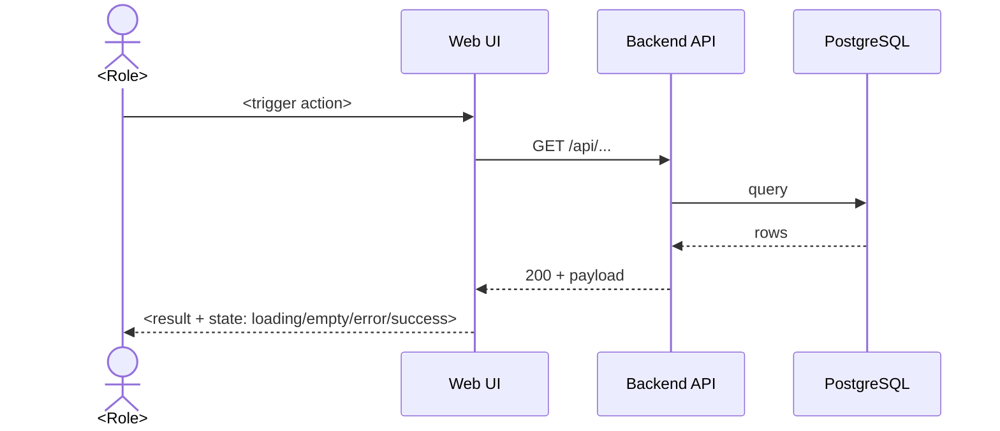

# PACS Requirements Architect — Skill

A requirements-engineering skill that converts any radiology role or feature request
into a complete, verifiable requirements package. It fuses three expert agents —
**frontend-developer** (implementation feasibility), **ui-ux-designer** (user-centered
design), and **ui-visual-validator** (skeptical verification) — into one pipeline:
*design requirements that are buildable, usable, and verifiable*.

---

## Section 0: Skill Invocation Map

| Trigger | Action |
|---------|--------|
| "create requirements for <role>" | Run full pipeline (Sections 5–6) for that role |
| "write user stories for <role>" | Produce artifact 03 only (user stories + AC) |
| "workflow map for <role>" | Produce artifact 02 only (Mermaid workflow maps) |
| "UI/UX requirements for <role>" | Produce artifact 04 only |
| "metrics and SLAs for <role>" | Produce artifact 05 only |
| "acceptance criteria for <role>" | Produce artifact 06 only |
| "traceability for <role>" | Produce artifact 07 only (traceability matrix) |
| "requirements for all 19 roles" | Run full pipeline for every role in Section 1 |
| "build requirements for <feature>" | Cross-role pass: all roles touching the feature |
| "acceptance criteria for <user story #N>" | Single story → Given/When/Then AC with validator gate |
| "update requirements for <role>" | Delta mode: produce only changed artifacts + DELTA.md |
| "validate requirements for <role>" | Run automated validation (Section 6.5) against existing package |
| "requirements status" | List all roles with package status (draft/approved/gated) |
| "requirements status --all" | List all roles with artifact counts, traceability status, and package status |

**Quick start:**
```bash
# Generate a full requirements package for a role
create requirements for super-admin

# Generate only the traceability matrix
create requirements for super-admin --traceability

# Generate only the implementation roadmap
create requirements for super-admin --roadmap

# Update a role incrementally
create requirements for super-admin --delta

# Validate an existing package
validate requirements for super-admin

# List all role package statuses
requirements status --all
```

**Rule:** Before producing any artifact, read the role definition (Section 1), the
deliverable templates (Section 3), and the agent-knowledge lens for that artifact
(Section 2). If the task touches PHI, HIPAA, or system integrations, consult the
cross-cutting section (Section 7) first.

**Delta mode (`--delta`)**: When a role's requirements change incrementally,
use `--delta` to produce only the changed artifacts and a `DELTA.md` diff
document. See Section 5, Step 12 for delta mode behavior.

---

## Section 1: Role Registry — 19 Personas

Each role has: ID, persona, system access tier, primary functions, and key workflows.
Use this registry as the source of truth for all requirements.

| ID | Role | Access Tier | Primary Functions | Equipment / Systems |
|----|------|-------------|-------------------|---------------------|
| R01 | Super Admin (PACS Admin) | Full system + tenant config | Tenant provisioning, DICOM AE management, storage rules, global settings, user/role RBAC, audit logs, system health | DICOM nodes, storage tiers, ES search |
| R02 | Hospital IT / Tenant Admin | Tenant-wide admin | Tenant users, departments, modalities, worklists, DICOM routing, integration endpoints, backups | Tenant config, HL7/RIS endpoints |
| R03 | Radiology & Imaging Service Director (senior radiologist) | Read + full analytics | Service KPIs, capacity/utilization dashboards, staffing, protocol governance, SLA oversight, reporting | Analytics dashboards, reports |
| R04 | Radiology & Service Coordinator (chief radiology technologist) | Department scheduler | Modality scheduling, exam assignment, resource utilization, stat/priority triage, staffing rosters, worklist management | Schedule board, modality calendars |
| R05 | Radiology Services QI/QA Team | Read + QA tools | Exam quality audits, protocol compliance, incident/retake tracking, ACR/regulatory compliance, corrective actions, QA scoring | QA dashboards, audit tools, protocols |
| R06 | Radiology Technologist | Operator (per exam) | Operates MRI, PET, CT, Fluoroscopy, Mammography, Ultrasound; exam capture, image QA, patient safety checks, dose documentation, exam completion | Modality worklist, image capture, dose records |
| R07 | Radiology Technician | Operator (per exam) | Operates DR, CR, Fluoroscopy, Mammography; positioning, acquisition, image QC, retakes, exam completion | Modality worklist, image capture |
| R08 | Front Desk (Receptionist) | Registration + scheduling | Patient registration, demographics, appointments, order intake, visit check-in, consent handling, insurance capture | Registration, scheduler, order intake |
| R09 | Radiology Service Cashier | Billing (read-only clinical) | Payment collection, invoice/payment records, insurance claim status, receipts, cash reconciliation | Billing, receipts, claim status |
| R10 | Biomedical Engineer | Equipment health | Equipment inventory, PM schedules, QC testing, downtime tracking, maintenance tickets, vendor contracts, alerting on equipment faults | Equipment registry, PM/QC calendars, alerts |
| R11 | Radiology Service Nursing Team | Patient care (during exam) | Patient prep, IV/contrast administration, monitoring during exam, adverse reaction response, pre/post exam care, vitals documentation | Nursing worklist, patient prep, vitals |
| R12 | Staff Radiologist | Clinical reading | Exam interpretation, structured reporting, priors comparison, critical findings escalation, impression management, report sign-off, peer review | Reading worklist, viewer, reporting |
| R13 | Radiology Trainee/Resident | Clinical reading (supervised) | Study interpretation, draft reports, attending review workflow, teaching file capture, exam list management | Reading worklist (supervised) |
| R14 | Referring Clinician | External read-only | Order placement, exam status tracking, report retrieval, image access, results notification, follow-up requests | Portal, notifications, reports |
| R15 | External RIS | System-to-system | Order exchange, scheduling sync, status updates (HL7/FHIR/DICOM MWL), report delivery | HL7/FHIR, DICOM MWL/MPPS |
| R16 | External EMR | System-to-system | Patient demographics (ADT), order context, report backfill, results status | HL7 ADT/ORM/ORU, FHIR |
| R17 | External PACS | System-to-system | Image exchange, query/retrieve, instance routing, archive synchronization | DICOM C-FIND/C-MOVE/C-STORE |
| R18 | Teleradiologist | Remote clinical reading | Remote study access, off-hours coverage, preliminary/stat reads, second opinions, consultations, secure remote access, final sign-off | Remote viewer, tele-reporting, consultation queue |
| R19 | Other Hospital Staff (nurse, lab, pharmacy) | Limited clinical | View own-patient imaging/results, order awareness, results notification | Portal (limited scope) |

### Per-role Requirements Profile

For each role, generate a profile block with these fields (R01 example below, apply
to all roles):

```markdown
## R01 — Super Admin (PACS Admin)

**Persona**: Senior systems administrator owning the entire PACS instance.
**Context**: Works in ops/IT office; manages multiple tenants; reacts to incidents;
  rarely uses the viewer for clinical work.
**Top tasks (by frequency)**:
  1. Create/manage tenants and users (daily)
  2. Monitor storage usage and system health (daily)
  3. Manage DICOM AE nodes and routing rules (weekly)
  4. Review audit logs (on incident/audit)
**Pain points**: multi-tenant config sprawl; audit compliance burden; no global view
  of storage; slow incident triage.
**Devices**: desktop (primary), laptop (secondary); no mobile requirement.
**Working patterns**: batch operations, scheduled checks, low tolerance for errors.
**PHI exposure**: Full access — high audit responsibility (HIPAA minimum necessary
  does not exempt admins from auditability).
```

---

## Section 2: Ingested Agent Knowledge Base — Three Agents, One Pipeline

This skill is a synthesis of three frontend agent files in `frontend/docs/`. Each
agent governs a stage of the requirements pipeline. Apply the listed lens whenever
producing the corresponding artifact.

### 2.1 frontend-developer → Implementation-Feasibility Lens (artifacts 01, 02, 04)

Knowledge ingested: React 19/Next.js 15 architecture, state management, performance,
accessibility, testing, PWA/offline, real-time data.

Requirements impact:
- **Performance requirements are quantified, not vague**: every screen with a
  large list or image grid must specify target Core Web Vitals (LCP < 2.5s,
  CLS < 0.1, INP < 200ms), and requirements must note where code splitting,
  virtualization, or lazy loading is expected (e.g., study list virtualization).
- **State requirements**: requirements must specify loading / empty / error /
  offline states for every data-driven screen — no screen may ship without all four.
- **Real-time requirements**: where live worklists or status updates are needed
  (R04 scheduler, R06/07 exam status), requirements must state sync mechanism
  (WebSocket/SSE/polling) and staleness tolerance (e.g., worklist refresh ≤ 5s).
- **Accessibility**: all requirements carry WCAG 2.1/2.2 AA acceptance criteria:
  keyboard operability, focus management, contrast ≥ 4.5:1, screen-reader labels.
- **Feasibility constraints**: if a requirement needs an API that does not exist,
  flag it and delegate to `frontend-to-backend-requirements` / `rest-api-design`.
- **Data-fetching design**: requirements note caching/refetch strategy (TanStack
  Query-style) and optimistic update expectations for high-frequency mutations.

Behavioral traits applied: prioritize UX and performance equally; require
comprehensive error handling and loading states; require TypeScript-safe contracts.

### 2.2 ui-ux-designer → User-Centered Design Lens (artifacts 02, 04)

Knowledge ingested: personas, journey mapping, information architecture, design
tokens, component libraries, accessibility-first design, research validation,
cross-platform consistency, data visualization.

Requirements impact:
- **Every artifact 02 (workflow map) is grounded in the persona's goals, not the
  system's**: start from user intent, trace the journey end-to-end, flag
  friction/cognitive load points.
- **UI/UX requirements reference the project design system** (`docs/design-tokens.json`,
  `docs/component-specs.md`): tokens for color, typography, spacing, radius; a
  component must be specified by behavior and state, not one-off styling.
- **Interaction states are designed, not assumed**: loading, empty, error,
  partial, success, disabled, focus, hover — each specified per component.
- **IA requirements**: navigation hierarchy, progressive disclosure, search and
  findability specified per role (e.g., R12 radiologist reading worklist vs R08
  registration flow).
- **Responsive/multi-device requirements**: breakpoint strategy and mobile-first
  decisions per role (clinical reading is desktop-heavy; R19 portal is mobile-friendly).
- **Data-visualization requirements**: dashboards (R03, R05, R10) specify chart
  type, density, progressive disclosure, and WCAG-accessible color ramps.

Behavioral traits applied: prioritize user needs and accessibility in every
decision; design systematically with tokens; document decisions with rationale;
validate with research and data.

### 2.3 ui-visual-validator → Skeptical Verification Gate (artifact 06, all artifacts)

Knowledge ingested: visual analysis, WCAG verification, responsive validation,
state validation, design-token compliance, mandatory verification checklist.

Requirements impact:
- **Acceptance criteria are written to be provable, not assumed** — every AC must
  be checkable by visual evidence or automated test, per the validator's "default
  assumption: NOT achieved until proven otherwise".
- **Mandatory verification checklist is embedded in the skill's quality gate
  (Section 6.4)** — adapted from the validator's checklist (contrast ratios,
  focus indicators, breakpoints, states, token compliance).
- **Forbidden assumptions** carry into AC writing: "looks different ≠ looks
  correct"; no acceptance criterion may be satisfied by code presence alone —
  it must reference observable behavior.
- **Output phrasing** for verification results follows the validator convention:
  "From the visual evidence, I observe..." with explicit achieved / partially
  achieved / not achieved verdicts.

Behavioral traits applied: default skepticism; systematic methodology; document
findings with precise measurable observations; challenge assumptions; never
declare success without concrete evidence.

---

## Section 3: Deliverables Framework — Seven Artifact Types

Every requirements package produces seven artifacts in the order below. Write each
as its own file under `docs/requirements/<role-slug>/`:

| # | Artifact | File | Contents |
|---|----------|------|----------|
| 01 | User Requirements | `01-user-requirements.md` | Functional + non-functional requirements, prioritized (MoSCoW), with IDs `FR-<role>-NN` / `NFR-<role>-NN` |
| 02 | Workflow Maps | `02-workflow-maps.md` | End-to-end workflow maps as Mermaid sequence/flowcharts, per top task |
| 03 | User Stories | `03-user-stories.md` | User stories with Given/When/Then acceptance criteria, story IDs `US-<role>-NN` |
| 04 | UI/UX Requirements | `04-ui-ux-requirements.md` | Layout, components, states, tokens, a11y, responsive, interaction spec |
| 05 | Metrics & SLAs | `05-metrics-slas.md` | Quantifiable KPIs and service-level agreements with targets and measurement method |
| 06 | Acceptance Criteria | `06-acceptance-criteria.md` | Verifiable acceptance criteria matrix mapped to FR/NF IDs, validator-gated |
| 07 | Traceability Matrix | `07-traceability.md` | Cross-artifact and cross-role dependency graph, FR→AC traceability, integration contract map |
| 08 | Implementation Roadmap | `08-implementation-roadmap.md` | Dependency-ordered implementation plan with status (done/partial/missing) per artifact |

Plus package metadata files in `docs/requirements/<role-slug>/`:
- `README.md` — role summary, artifact index, cross-role dependencies, version, status
- `CHANGELOG.md` — dated changelog following Keep a Changelog format
- `DELTA.md` — produced only in delta mode; lists incremental changes

---

## Section 4: Artifact Templates

### Artifact 01 — User Requirements

```markdown
# User Requirements — <Role Name> (RXX)

## Functional Requirements

| ID | Requirement | Priority | Notes |
|----|-------------|----------|-------|
| FR-RXX-01 | As <role>, the system SHALL allow ... | Must/Should/Could | (link to workflow) |

## Non-Functional Requirements

| ID | Requirement | Target | Measurement |
|----|-------------|--------|-------------|
| NFR-RXX-01 | Load time for <screen> | LCP ≤ 2.5s | Lighthouse/WebPageTest |
| NFR-RXX-02 | Worklist freshness | ≤ 5s staleness | Synthetic probe |

## Assumptions & Constraints
- (PHI handling, integration contracts, device constraints, offline needs)
```

### Artifact 02 — Workflow Maps

```markdown
# End-to-End Workflow Maps — <Role Name> (RXX)

## Workflow W1: <Task name> (frequency: daily, criticality: high)



### Friction & Cognitive Load Points
- (flag per step: search latency, multi-window switching, duplicate data entry)
### Error & Exception Paths
- (timeouts, missing data, permission denied, integration outage)
```

### Artifact 03 — User Stories

```markdown
# User Stories — <Role Name> (RXX)

## US-RXX-01: <Short title>
**Story**: As a <role>, I want <capability>, so that <benefit>.
**Priority**: Must | Should | Could | Won't

### Acceptance Criteria
- **Given** <precondition>, **when** <action>, **then** <observable result>.
- **Given** <error precondition>, **when** <action>, **then** <error state with clear recovery>.
- **Given** <empty state>, **when** <screen opens>, **then** <meaningful empty state + CTA>.
- **Accessibility**: <WCAG requirement for this interaction>.
- **Performance**: <LCP/INP target for this interaction>.

### Dependencies
- (related stories, API endpoints, external systems)
```

### Artifact 04 — UI/UX Requirements

```markdown
# UI/UX Requirements — <Role Name> (RXX)

## Screens & Navigation
- (screen inventory, IA, entry points, breadcrumbs/back paths)

## Component & State Spec (per screen)
| Component | Default | Loading | Empty | Error | Success | Disabled |
|-----------|---------|---------|-------|-------|---------|----------|

## Design System Conformance
- Tokens: (reference docs/design-tokens.json — color, type, spacing, radius)
- Components: (reference docs/component-specs.md)

## Accessibility Requirements
- WCAG 2.1/2.2 AA: keyboard, focus, contrast ≥ 4.5:1, ARIA, screen-reader labels

## Responsive Behavior
- Breakpoints: (base/md/lg per screen; desktop-first for clinical reading)

## UX Principles Applied
- (progressive disclosure, cognitive load, error recovery, trust & safety for clinical data)
```

### Artifact 05 — Metrics & SLAs

```markdown
# Metrics & SLAs — <Role Name> (RXX)

| ID | Metric | Target | Measurement | Frequency | Owner |
|----|--------|--------|-------------|-----------|-------|
| M-RXX-01 | (e.g., study list load time) | ≤ 2.5s LCP / ≤ 200ms INP | Lighthouse CI, RUM | Per release | Frontend |
| M-RXX-02 | (e.g., worklist staleness) | ≤ 5s | Synthetic probe | Daily | Backend |
| M-RXX-03 | (e.g., report turnaround) | STAT ≤ 30min, routine ≤ 24h | DB query on report timestamps | Weekly | Clinical ops |

## SLA Tiers
- Availability: 99.9% for critical reading paths (R12/R18)
- Support: incident response ≤ 15min for P1, ≤ 4h for P2
```

### Artifact 06 — Acceptance Criteria (validator-gated)

```markdown
# Acceptance Criteria — <Role Name> (RXX)

| AC ID | Links to | Criteria (Given/When/Then) | Verification Method | Validator Gate |
|-------|----------|----------------------------|---------------------|----------------|
| AC-RXX-01 | FR-RXX-01 | Given ..., when ..., then ... | Automated test / visual evidence | Must pass Section 6.4 checklist |

## Excluded Scope / Out of Scope
- (explicitly list what is NOT covered, per validator's critical mindset)
```

### Artifact 07 — Traceability Matrix

```markdown
# Traceability Matrix — <Role Name> (RXX)

## FR/NFR → AC Traceability

| FR/NFR ID | Covered by AC | AC IDs | Status |
|-----------|---------------|--------|--------|
| FR-RXX-01 | Yes | AC-RXX-01, AC-RXX-03 | Covered |
| FR-RXX-02 | No | — | Gap — no AC yet |
| NFR-RXX-01 | Yes | AC-RXX-30 | Covered |

## Cross-Artifact Dependencies

| Source Artifact | Target Artifact | Dependency |
|-----------------|-----------------|------------|
| 01 User Requirements | 03 User Stories | Each US maps to ≥1 FR |
| 01 User Requirements | 06 Acceptance Criteria | Each FR/NFR has ≥1 AC |
| 02 Workflow Maps | 03 User Stories | Each workflow step with user decision → US |
| 03 User Stories | 04 UI/UX Requirements | Each US component → state spec |
| 04 UI/UX Requirements | 06 Acceptance Criteria | Each state → validator gate |
| 05 Metrics & SLAs | 06 Acceptance Criteria | Each metric target → measurable AC |

## Cross-Role Dependencies

| Role | Dependency Type | Target Role | Contract |
|------|----------------|-------------|----------|
| R01 Super Admin | Provisions tenant | R02 Tenant Admin | Tenant config + credentials |
| R12 Staff Radiologist | Consumes worklist | R06 Technologist | Exam status updates |
| R18 Teleradiologist | Remote reading | R12 Staff Radiologist | Report sign-off handoff |

## Integration Contracts (R15–R17)

| Integration | Direction | Protocol | Failure Semantics |
|-------------|-----------|----------|-------------------|
| External RIS (R15) | R15 → R01/R02 | HL7 ORM/ORU, FHIR ServiceRequest | Retry 3x → dead-letter → manual reconciliation |
| External EMR (R16) | R16 → R01/R02 | HL7 ADT/ORM/ORU, FHIR Patient | Async backfill, no blocking |
| External PACS (R17) | R17 ↔ R01/R02 | DICOM C-FIND/C-MOVE/C-STORE | Query timeout 30s, retrieve retry 2x |
```

## Excluded Scope / Out of Scope
- (explicitly list what is NOT covered, per validator's critical mindset)
```

### Delta Document (DELTA.md) — Incremental Updates

```markdown
# Delta — <Role Name> (RXX) — <YYYY-MM-DD>

## Summary

- **Trigger**: <PR/issue number or stakeholder request>
- **Version change**: 1.X.Y → 1.X+1.Y (MAJOR/MINOR/PATCH)
- **Stakeholder**: <name, role>

## Added Requirements

| ID | Requirement | Priority | Rationale |
|----|-------------|----------|-----------|
| FR-RXX-NN | ... | Must/Should/Could | Why this is needed now |

## Changed Requirements

| ID | Field Changed | Old Value | New Value | Rationale |
|----|---------------|-----------|-----------|-----------|
| FR-RXX-NN | Priority | Must | Should | <reason> |
| FR-RXX-NN | Target | ≤ 5s | ≤ 3s | <reason> |

## Removed Requirements

| ID | Requirement | Rationale for Removal |
|----|-------------|-----------------------|
| FR-RXX-NN | ... | <reason> |

## Impact on Existing Artifacts

| Artifact | Changed? | Summary |
|----------|----------|---------|
| 01 User Requirements | Yes | Added FR-RXX-NN |
| 03 User Stories | Yes | New US for FR-RXX-NN |
| 06 Acceptance Criteria | Yes | New AC for FR-RXX-NN |
| 07 Traceability Matrix | Yes | New row for FR-RXX-NN |
```

### CHANGELOG.md Template

```markdown
# Changelog — <Role Name> (RXX)

All notable changes to this requirements package follow
[Keep a Changelog](https://keepachangelog.com/en/1.0.0/) format.

## [Unreleased]

## [1.1.0] — 2026-08-02
### Added
- FR-RXX-NN: <requirement description>
- US-RXX-NN: <user story title>
### Changed
- FR-RXX-NN: <what changed and why>
### Deprecated
- FR-RXX-NN: <reason>

## [1.0.0] — 2026-08-01
### Added
- Initial requirements package for <role>
```

### Artifact 08 — Implementation Roadmap

```markdown
# Implementation Roadmap — <Role Name> (RXX)

## Artifact Status Overview

| # | Artifact | File | Status | Notes |
|---|----------|------|--------|-------|
| 01 | User Requirements | `01-user-requirements.md` | done/partial/missing | |
| 02 | Workflow Maps | `02-workflow-maps.md` | done/partial/missing | |
| 03 | User Stories | `03-user-stories.md` | done/partial/missing | |
| 04 | UI/UX Requirements | `04-ui-ux-requirements.md` | done/partial/missing | |
| 05 | Metrics & SLAs | `05-metrics-slas.md` | done/partial/missing | |
| 06 | Acceptance Criteria | `06-acceptance-criteria.md` | done/partial/missing | |
| 07 | Traceability Matrix | `07-traceability.md` | done/partial/missing | |
| 08 | Implementation Roadmap | `08-implementation-roadmap.md` | done/partial/missing | |

## FR/NFR Implementation Status

### Implemented (Passing ACs)

| FR/NFR ID | Summary | AC Coverage | Effort |
|-----------|---------|-------------|--------|
| FR-RXX-01 | ... | AC-RXX-01, 02 | S (1-3d) |

### Partially Implemented (GATED / Partial)

| FR/NFR ID | Summary | Blocking Dependency | AC | Effort |
|-----------|---------|---------------------|----|--------|
| FR-RXX-NN | ... | Backend endpoint X does not exist | AC-RXX-NN | M (4-10d) |

### Missing (Not Started)

| FR/NFR ID | Summary | Reason | AC | Effort |
|-----------|---------|--------|----|--------|
| FR-RXX-NN | ... | Backlog / not yet scoped | — | L (11+d) |

## Effort Estimation Key

| Size | Days | Criteria |
|------|------|----------|
| S (Small) | 1–3 | Single endpoint or UI component; no cross-team dependency |
| M (Medium) | 4–10 | Multi-step feature; requires backend + frontend coordination |
| L (Large) | 11+ | Cross-cutting feature; requires integration contract or new infrastructure |

## Dependency-Ordered Implementation Plan

### Phase 1: Foundation (already done)
- Artifacts 01–06 complete; NFRs implemented and passing

### Phase 2: Unblock GATED requirements (next priority)
1. **[Blocking dependency]** — required for [FR/NFR ID] / [AC ID]
   - Owner: [team]
   - Blocks: [AC IDs]
   - Effort: [S/M/L]
   - Once done, re-run validator gate on [AC ID]

### Phase 3: Traceability and roadmap maintenance
3. **Artifact 07 traceability matrix** — partial; verify all cross-role dependencies
4. **Artifact 08 roadmap** — partial; update each sprint as FR/NFR status changes

## Blocking Dependencies

| Blocking Dependency | Blocks | AC | Impact |
|---------------------|--------|----|--------|
| [Dependency] | [FR/NFR] | [AC] | [Impact] |

## Next Steps (highest priority)

1. **[Action]** — unblocks [AC/FR]; [Effort] effort
2. **[Action]** — unblocks [AC/FR]; [Effort] effort
3. **[Action]** — update roadmap each sprint as FR/NFR status changes
```

Execute in order for each role (or cross-role pass):

1. **Profile the role**: write the role profile (Section 1 format) if not present.
   Read existing docs (`docs/User-Stories.md`, `docs/UX-Functionality.md`,
   `docs/PRD-v3.md`, `docs/SPRINT_ARTIFACT.md`, `docs/user-flows/`) for prior context.
2. **Artifact 01 — User Requirements**: FR/NFR with IDs, priorities, assumptions.
   Apply the frontend-developer lens: quantify performance, require all states,
   check API feasibility (delegate to `frontend-to-backend-requirements` if new
   endpoints needed).
3. **Artifact 02 — Workflow Maps**: Mermaid maps per top task with friction,
   error paths, and integration touchpoints (R15–R17 require system-sequence
   diagrams with HL7/DICOM/FHIR boundaries).
4. **Artifact 03 — User Stories**: story + Given/When/Then AC + a11y + performance.
   One story per workflow step that has user decision-making.
5. **Artifact 04 — UI/UX Requirements**: screens, states, tokens, a11y, responsive.
   Apply the ui-ux-designer lens; reuse the design system; flag new components.
6. **Artifact 05 — Metrics & SLAs**: quantitative targets with measurement method
   and owners; align with R03/R05 reporting requirements.
7. **Artifact 06 — Acceptance Criteria**: matrix mapping to FR/NFR IDs; every AC
   verifiable by test or visual evidence.
8. **Validator gate (Section 6.4)**: run the skeptical verification pass over the
   whole package; record verdicts per artifact.
9. **Write outputs** to `docs/requirements/<role-slug>/` + `README.md` index.
10. **Stakeholder review loop**: present the package to the role's primary
    stakeholder (e.g., R01 → super admin, R12 → staff radiologist). Record
    feedback as issues in `docs/requirements/<role-slug>/feedback.md` with
    each item linked to the artifact and section it affects.
11. **Refine**: for each feedback item, update the relevant artifact(s),
    re-run the quality gates (Section 6), and update the validator gate
    verdict in artifact 06. Iterate until all feedback is resolved or
    explicitly deferred with rationale.
12. **Finalize**: bump the package version (Section 8), commit the
     `CHANGELOG.md` entry, and mark the package as `approved` in the
     README. A package in `draft` status must not be referenced by sprint
     planning or implementation documents.
13. **Artifact 08 — Implementation Roadmap**: produce a dependency-ordered
     implementation plan that shows what is already implemented, what is
     partial, and what is missing for each artifact. The roadmap is
     generated from the traceability matrix (artifact 07) and cross-role
     dependencies. See artifact 08 template in Section 3 for format.

**Cross-role pass (feature-driven)**: identify roles touching the feature, produce
the shared workflow map, then per-role artifacts; list integration dependencies
(R15/R16/R17 contracts, R18 remote access, R03/R05 reporting consumers).

**Delta mode (`--delta`)**: when a role's requirements change incrementally
(e.g., new FR added, priority changed, measurement target adjusted), run the
pipeline with `--delta` to produce only the changed artifacts and a
`CHANGELOG.md` entry. The delta mode:
- Reads the existing package in `docs/requirements/<role-slug>/`
- Compares against the current state of the role registry (Section 1)
- Produces a diff document at `docs/requirements/<role-slug>/DELTA.md`
  listing added/changed/removed requirements with rationale
- Updates only the affected artifacts (not the full package)
- Re-runs the quality gates against the delta only
- Requires explicit stakeholder sign-off on the delta before merging

---

## Section 6: Quality Gates

### 6.1 Completeness Gate
- [ ] All 7 artifacts exist with IDs in the FR/NFR/US/AC/M conventions
- [ ] Every FR has at least one AC; every AC links to an FR/NFR
- [ ] All 4 states (loading/empty/error/success) specified for each data screen
- [ ] Traceability matrix (07) covers every FR/NFR with no gaps
- [ ] Cross-role dependencies listed in README match the traceability matrix

### 6.2 Feasibility Gate (frontend-developer lens)
- [ ] Performance targets are quantified (LCP/INP/CLS, staleness tolerance)
- [ ] Every requirement maps to an existing API or flags a new one
- [ ] Accessibility ACs are concrete (WCAG 2.1/2.2 AA, keyboard, contrast)

### 6.3 Usability Gate (ui-ux-designer lens)
- [ ] Workflow maps start from user intent and flag friction points
- [ ] Components reference design tokens / component specs; no one-off styling
- [ ] Error, empty, and recovery paths are designed, not accidental

### 6.4 Validator Gate (ui-visual-validator lens) — Mandatory Verification Checklist
Adapted from the ui-visual-validator agent. Apply to every acceptance criterion
that claims a UI outcome:
- [ ] Is the AC stated in observable terms, not "implemented in code"?
- [ ] Does the AC specify measurable contrast ≥ 4.5:1 where color is used?
- [ ] Does the AC cover focus indicators and keyboard operability?
- [ ] Does the AC specify responsive breakpoint behavior?
- [ ] Does the AC cover loading, empty, error, and success states?
- [ ] Does the AC require design-token compliance (no off-system colors/type)?
- [ ] Have I actively searched for failure evidence (reverse validation)?
- [ ] Does "different" actually mean "correct"? (no assumption accepted)

Verdict format: **"From the visual evidence/verification, I observe ... — goal
achieved / partially achieved / not achieved"** with specific measurements.

### 6.5 Automated Validation

The following automated checks should be run against every package before
it is marked complete. These are not replacements for the manual gates above
but catch regressions and inconsistencies early.

#### 6.5.1 ID Consistency Check
- [ ] Every `FR-`, `NFR-`, `US-`, `AC-`, and `M-` ID uses the correct role prefix (e.g., `R01` for super-admin)
- [ ] IDs are zero-padded to two digits within each artifact (FR-R01-01, not FR-R01-1)
- [ ] Every AC links to at least one FR or NFR; every FR has at least one AC
- [ ] No duplicate IDs within an artifact

#### 6.5.2 Traceability Check
- [ ] Every FR/NFR appears in the traceability matrix (artifact 07)
- [ ] Every US links to at least one FR
- [ ] Every AC links to at least one FR or NFR
- [ ] Cross-role dependencies listed in README match the traceability matrix

#### 6.5.3 Quantification Check
- [ ] Every performance requirement has a numeric target and measurement method
- [ ] Every SLA has a target, frequency, and owner
- [ ] No requirement uses "fast", "responsive", "user-friendly", or "scalable" without a quantified target
- [ ] Every data screen specifies all 4 states (loading/empty/error/success)

#### 6.5.4 Verifiability Check
- [ ] Every AC is stated in observable terms (not "implemented in code")
- [ ] Every AC specifies a verification method (automated test, visual evidence, synthetic probe, E2E)
- [ ] No AC is satisfiable by code presence alone
- [ ] Gated ACs (blocked on backend/frontend work) are explicitly marked with `GATED` and the blocking dependency

#### 6.5.5 Script Integration
- Run `scripts/validate-requirements.sh <role-slug>` to execute checks 6.5.1–6.5.4 automatically
- The script reads `docs/requirements/<role-slug>/` and outputs a pass/fail report
- Exit code 0 = all checks pass; exit code 1 = failures found with details
- Integrate into CI: `pytest backend/tests/` and `scripts/validate-requirements.sh` as a pre-merge gate for any `docs/requirements/` changes

### 6.6 Implementation Roadmap Gate (artifact 08)
- [ ] Artifact 08 exists and covers all 7 artifacts (01–07) plus the package itself
- [ ] Each artifact has a status: `done` (fully implemented), `partial` (some work done), or `missing` (not started)
- [ ] Dependencies between artifacts are correctly ordered (e.g., artifact 01 must be done before 03; artifact 07 must be done before 08)
- [ ] Cross-role dependencies are listed with their current status
- [ ] The roadmap identifies blocking dependencies (e.g., "backend API for FR-R01-05 must be done before UI work on US-R01-12")
- [ ] The roadmap includes estimated effort (small/medium/large) per artifact
- [ ] The roadmap includes a "next steps" section with the 1–3 highest-priority actions to move from `missing` to `partial`
- [ ] The roadmap is consistent with the traceability matrix (artifact 07) — no phantom dependencies

---

## Section 9: Document Discovery

The skill dynamically discovers agent knowledge files and grounding documents at runtime. No hardcoded paths are used in the metadata or pipeline.

### 9.1 Agent Knowledge Sources

Agent source files are discovered by scanning the `frontend/docs/` directory for `.md` files. Each file becomes a knowledge lens for the pipeline. The discovery rules are:

1. Scan `frontend/docs/*.md` for all markdown files
2. Each file's basename (without extension) becomes the agent identifier (e.g., `frontend-developer`, `ui-ux-designer`, `ui-visual-validator`)
3. The file's content is ingested as the knowledge base for that agent
4. If a file is not present, the corresponding agent lens is skipped with a warning

### 9.2 Grounding Documents

Grounding documents are discovered by scanning the `docs/` directory (excluding `docs/requirements/`) for markdown files. The discovery rules are:

1. Scan `docs/*.md` and `docs/**/*.md` for all markdown files
2. Exclude `docs/requirements/` (those are output artifacts, not input documents)
3. Exclude `docs/decisions/` (ADR documents are referenced separately)
4. Each discovered file is available as a grounding document for the pipeline
5. The pipeline reads grounding documents when profiling roles (Section 5, Step 1) and when generating cross-role dependencies

### 9.3 Discovery Output

The discovery process produces a manifest at the start of each pipeline run:

```markdown
## Document Discovery Manifest

### Agent Sources Discovered
- `frontend/docs/frontend-developer.md` → frontend-developer lens
- `frontend/docs/ui-ux-designer.md` → ui-ux-designer lens
- `frontend/docs/ui-visual-validator.md` → ui-visual-validator lens

### Grounding Documents Discovered
- `docs/PRD-v3.md`
- `docs/User-Stories.md`
- `docs/UX-Functionality.md`
- `docs/SPRINT_ARTIFACT.md`

### Missing Expected Sources
- (none, or list expected files not found)
```

The manifest is written to the pipeline log and used to validate that all expected knowledge sources are available before the pipeline begins.

---

## Section 7: Cross-Cutting Concerns

### 7.1 HIPAA / PHI (delegate to `hipaa-compliance`)
- Every role's requirements must state PHI access scope and minimum necessary.
- Audit logging is a requirement for R01/R02/R12/R18 actions.
- No PHI in URLs, logs, or analytics events — specify this in NFRs.
- Consent handling (R08/R11) and patient-facing data (R19) requirements.

### 7.2 DICOM / HL7 / FHIR Integrations (R15–R17, delegate to `rest-api-design`)
- Specify exact interfaces: DICOM MWL/MPPS/C-STORE/C-MOVE/C-FIND; HL7 ADT/ORM/ORU;
  FHIR resources (Patient, ServiceRequest, DiagnosticReport).
- Define failure semantics: retry, dead-letter, manual reconciliation workflows.
- R18 teleradiology: secure remote access (VPN/SSO), offline-tolerant viewer,
  preliminary vs final read states.

### 7.3 Regulatory & QA (R05)
- Requirements must support ACR/regulatory audit data capture (QA scores,
  incident/retake logs, protocol compliance) as structured data, not free text.

### 7.4 Accessibility & Inclusive Design (all roles)
- WCAG 2.1/2.2 AA minimum; color-blind-safe palettes for dose maps and
  heatmaps (R06/R10); keyboard-only workflows for reading stations.

### 7.5 Performance SLOs
- Clinical reading paths (R12/R18): image load ≤ 2s, viewer interactions
  INP ≤ 200ms; scheduler board (R04) live updates ≤ 5s staleness.

---

## Section 8: Output Conventions

- **Directory**: `docs/requirements/<role-slug>/` — slug from role name:
  `super-admin`, `tenant-admin`, `service-director`, `service-coordinator`,
  `qa-team`, `technologist`, `technician`, `front-desk`, `cashier`,
  `biomedical-engineer`, `nursing`, `staff-radiologist`, `resident`,
  `referring-clinician`, `external-ris`, `external-emr`, `external-pacs`,
  `teleradiologist`, `hospital-staff`.
- **README.md** per role: summary, artifact index, cross-role dependencies,
  open questions, version (SemVer), status (`draft` | `approved`),
  changelog reference, and date of last update.
- **IDs**: FR/NFR/US/AC/M prefixed by role ID (`R01`–`R19`), zero-padded per artifact.
- **Mermaid** for all workflow maps (sequenceDiagram for user flows,
  flowchart for decision/exception paths, sequenceDiagram for system integrations).
- **No vague language**: replace "fast", "responsive", "user-friendly" with
   quantified targets and observable outcomes.
- **Version tracking**: every package has a `version` field in its README
   following SemVer (`MAJOR.MINOR.PATCH`). Increment:
   - MAJOR: breaking changes to requirements or API contracts
   - MINOR: new requirements added, existing requirements refined
   - PATCH: clarifications, typo fixes, measurement target adjustments
- **Changelog**: each package includes a `CHANGELOG.md` with dated entries
   linking to the triggering PR/issue. Format:
   ```markdown
   ## [1.1.0] — 2026-08-02
   ### Added
   - FR-R12-09: Peer review workflow for structured reports
   ### Changed
   - FR-R12-04: Updated report turnaround target from 24h to 12h for STAT
   ### Deprecated
   - FR-R12-03: Legacy free-text reporting (superseded by structured reporting)
   ```
- **Diff-friendly output**: all artifacts use deterministic ordering (IDs
   ascending, tables sorted by ID) so that `git diff` produces meaningful
   line-level changes between versions. No reordering of existing rows.
- **Package header version**: the README header includes `version` and
   `Generated` date, e.g.: `Generated by the pacs-requirements-architect
   skill (v1.1.0) on 2026-08-02.`
