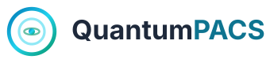

# QuantumPACS Brand Kit

> **Logic:** The design token system (`frontend/src/common/tokens.css`, mirrored in `docs/design-tokens.json`) is the source of truth for every value in this kit. Where a component spec in `design-system/quantumpacs/MASTER.md` contradicts this kit, **this kit wins** — it reflects the shipped app.
>
> **Version:** 1.0 · **Updated:** 2026-08-11 · **Owner:** Product / Design

---

## 1. Brand Strategy

| | |
|---|---|
| **Category** | Enterprise medical imaging (PACS) — DICOM-native radiology platform |
| **Audience** | Radiologists, technologists, reading physicians, PACS/front-desk admins, hospital IT |
| **Product function** | Acquire, store, route, retrieve and read medical images with zero-compromise speed and auditability |
| **Emotional promise** | *Clarity under pressure.* Diagnostic certainty delivered at quantum speed |
| **Core metaphor** | **The quantum orbit** — an atom in stable, precise motion. The nucleus is the patient; the orbit is the study moving through the system. Deterministic, fast, calm |
| **Trust level** | Highest — PHI/imaging data, HIPAA posture, audit trails, RBAC tenancy |
| **Visual world** | Calm clinical precision: deep slate, cyan signal, teal confirmation. Dark-first for the reading room, clean light mode for admin/front desk |
| **What the brand avoids** | Neon, purple "AI glow", playful gradients, noise, motion for its own sake, consumer-app cheer |

**Tagline:** *Diagnostic Clarity, Quantum Fast.* (shipped on the login screen)

---

## 2. Logo System

### 2.1 Mark — "The Orbit"

The QuantumPACS mark is a **quantum atom reduced to its minimum**: a nucleus (center dot) circled by an orbit ring, with a second inner orbit and a polar axis. It encodes three ideas:

1. **The nucleus** (center) — the patient, the single source of truth.
2. **The orbit** (ring + ellipse) — the study in deterministic motion through the PACS.
3. **The axis** (vertical ticks) — the scan plane; imaging itself.

The mark is drawn with a **three-stop brand gradient**: `blue-600 → cyan (secondary) → teal (accent)` — the exact stops used by `QuantumLogo.tsx`.

### 2.2 Construction

```
                    │  ← axis tick (2px, gradient)
        ┌───────────┼───────────┐
        │  ╭───────╮│           │
        │  │   ●   ││   inner ring  (secondary, 50%)
        │  ╰───────╯│   r=10
        │        ◖━━━━━━━   orbit ellipse (accent, 60%)
        │          │
        └───────────┼───────────┘
                    │  ← axis tick (2px, gradient)
        Outer ring r=18, stroke 3px, gradient
        Nucleus r=2.5, gradient fill
```

- **Canvas:** 40×40 viewport for the icon; the lockup is 180×40 (`viewBox="0 0 180 40"`).
- **Outer ring:** radius 18, stroke 3, gradient stroke.
- **Inner ring:** radius 10, stroke 2, secondary color at 50% opacity.
- **Orbit ellipse:** rx 6 / ry 2.5, stroke 1.5, accent at 60% opacity.
- **Axis ticks:** 2px rounded lines at top/bottom, gradient.
- **Nucleus:** 2.5px radius, gradient fill.

### 2.3 Gradient

| Stop | Light token | Dark token | Role |
|---|---|---|---|
| 1 | `--color-blue-600` `#0077B6` | `#0077B6` | Deep quantum blue — start |
| 2 | `--color-secondary` `#22D3EE` | `#67E8F9` | Cyan signal — middle |
| 3 | `--color-accent` `#059669` | `#34D399` | Teal confirmation — end |

The gradient is **non-negotiable**. Do not flatten the mark to a single color; the three-stop arc is the brand.

### 2.4 Wordmark

- **Typeface:** system-ui sans (`Inter, -apple-system, ...`), weight 700, size 16 on the 180×40 canvas.
- **"Quantum"** — `--sidebar-text` (slate-300): the wordmark always sits on the dark sidebar (`slate-900` in **both** themes), so the light-mode text token (near-black) is wrong there.
- **"PACS"** — `--color-secondary` (cyan). The accent carries the product word; *Quantum* is the house name.

### 2.5 Logo usage in product

| Surface | Size | Form | Notes |
|---|---|---|---|
| Sidebar (expanded) | 32 | Lockup (icon + wordmark) | `QuantumLogo size={32}` |
| Sidebar (collapsed / mobile) | 32 | Icon only | `showText={false}`; centered |
| Login card | 48 | Lockup | Centered, 32px below card top |
| Favicon | 40 | Icon only | Simplified 2-ring mark, gradient (`frontend/index.html`) |

### 2.6 Clearspace & minimum size

**Clearspace (icon)** — keep **2.5 canvas units** free on all sides. The measurement is taken from the mark's **ink edge**, not the ring centerline: the outer ring (r 18, stroke 3) reaches `20 ± 19.5`, i.e. the ink spans **0.5 → 39.5** on the 40×40 canvas. The exclusion zone therefore runs `0.5 − 2.5 = −2` → `39.5 + 2.5 = 42` — the 40×40 canvas is the mark's viewport; the zone is allowed to extend beyond it. The nucleus radius (r 2.5) is the clearance unit.

**Clearspace (lockup)** — the wordmark's x-height on all sides of the full lockup.

**Minimum sizes:**

| Form | Minimum | Below this |
|---|---|---|
| Icon-only | **24px** | Ticks and ellipse lose legibility — use the simplified favicon ring |
| Lockup (icon + wordmark) | **140px** wide | Wordmark becomes unreadable |
| Favicon ring | ≥12px | Ring form's legibility floor (shipped at 40px, §2.5) |

The `2.5u` ink-edge measurement is drawn to scale in the brand board (`design-system/quantumpacs/brand-board.html`, panel 07 — Clearspace).

### 2.7 Logo misuse — never

- ❌ Re-color or flatten the gradient (no solid-color mark).
- ❌ Rotate the mark, flip it, or tilt the orbit ellipse.
- ❌ Change the wordmark font or split "QuantumPACS" differently.
- ❌ Place on a busy or mid-tone background (dark `slate-900` or `white` only).
- ❌ Add shadows, glows, or 3D bevels.
- ❌ Swap "PACS" to a non-cyan color.

### 2.8 Color variants (icon)

| Variant | File | Use |
|---|---|---|
| Full color (gradient) | `logos/orbit-current-icon.svg` | Brand moments — white or `slate-900` surfaces |
| Monochrome dark | `logos/orbit-current-icon-mono-dark.svg` | Light backgrounds, B&W print, fax, embossing |
| Monochrome light (reversed) | `logos/orbit-current-icon-mono-light.svg` | Dark surfaces, splash, one-color dark media |

Monochrome variants use a single ink color (`#1E293B` / `#FFFFFF`) with the inner ring at 50% and ellipse at 60% opacity to preserve the mark's depth without the gradient.

### 2.9 Layouts

| Layout | File | Min width | Use |
|---|---|---|---|
| Horizontal lockup | `logos/orbit-current-lockup.svg` | 140px | Web header, cards, email |
| Vertical lockup | `logos/orbit-current-lockup-vertical.svg` | 120px | Social profiles, app-store, signage — light/print variant (wordmark slate-800); use the mono-light icon on dark surfaces |
| Icon only | `logos/orbit-current-icon.svg` | 24px | Sidebar, favicon-up, watermarks |
| Favicon ring | inline in `frontend/index.html` | 12px | Browser tab, tiny contexts |

### 2.10 Asset inventory (Phase 6 — file org)

All Orbit assets live in `design-system/quantumpacs/logos/` (SVG, viewBox-scalable). Every family follows the same treatment: **icon · icon-mono-dark · icon-mono-light · favicon · horizontal lockup · vertical lockup** (the Orbit's favicon is additionally inlined in `frontend/index.html`).

```
logos/
  orbit-current-icon.svg                · full-color icon (40×40)
  orbit-current-icon-mono-dark.svg      · slate-800 icon
  orbit-current-icon-mono-light.svg     · white reversed icon
  orbit-current-lockup.svg              · horizontal lockup (340×80)
  orbit-current-lockup-vertical.svg     · vertical lockup (200×180)
  orbit-current-favicon.svg             · simplified favicon ring (40×40)
  round2/                               · recommended refinement families
    qorbit-icon.svg                     · Q-Orbit icon
    qorbit-icon-mono-dark.svg           · Q-Orbit slate-800
    qorbit-icon-mono-light.svg          · Q-Orbit white reversed
    qorbit-favicon.svg                  · Q-Orbit simplified favicon
    qorbit-lockup-horizontal.svg        · Q-Orbit horizontal lockup
    qorbit-lockup-vertical.svg          · Q-Orbit vertical lockup
    aperture-icon.svg                   · Aperture icon
    aperture-icon-mono-dark.svg         · Aperture slate-800
    aperture-icon-mono-light.svg        · Aperture white reversed
    aperture-favicon.svg                · Aperture simplified favicon
    aperture-lockup-horizontal.svg      · Aperture horizontal lockup
    aperture-lockup-vertical.svg        · Aperture vertical lockup
    ROUND2-REFINEMENT.md                · what changed, usage rules
  CONCEPTS-EXPLORATION.md               · round-1 concept rationale
  COMPARISON-GALLERY.html               · stakeholder gallery + scoring matrix
  png/                                  · PNG exports for slides & email signatures
    orbit/                              · icon/mono/favicon at 32·48·64·128, lockups at 128·256·512
    qorbit/                             · Q-Orbit family, same sizes
    aperture/                           · Aperture family, same sizes
  EMAIL-SIGNATURE-KIT.html              · copy-paste signature blocks (Outlook/Gmail)
  scripts/
    export_pngs.py                      · batch SVG→PNG exporter (all sizes, all families)
```

**PNG export set** (regenerated via headless Chrome — see §2.11): square assets render at **32 / 48 / 64 / 128px**; lockups render at **128 / 256 / 512px** along their long axis (the 140px lockup minimum makes sub-128 lockup exports unusable). Each family additionally ships **`{family}-lockup-mono-light-{128,256,512}.png`** — reversed white-ink lockups (cyan `PACS` accent, secondary mark elements at reduced opacity) for dark email themes, generated by `scripts/export_mono_lockups.py` in the same way. All PNGs are transparent-background RGBA.

**Email signatures:** `logos/EMAIL-SIGNATURE-KIT.html` renders copy-paste-ready, email-safe HTML tables (inline styles only — no flexbox/classes) for every family on white and slate-900. It supports a hosted base-URL field that rewrites image paths to absolute URLs before copying. Gmail: Settings → Signature. Outlook: File → Options → Mail → Signatures → Edit with HTML.

### 2.11 Export & web embed (Phase 7)

**SVG → PNG** (for print or legacy email):

```bash
# Inkscape
inkscape logos/orbit-current-icon.svg --export-png=orbit-icon.png --export-width=1000
# ImageMagick
convert -background none logos/orbit-current-icon.svg orbit-icon.png
# Headless Chrome (already used to generate logos/png/ — renders exact aspect ratios, RGBA)
google-chrome --headless --disable-gpu --no-sandbox --force-device-scale-factor=1 \
  --window-size=128,128 --default-background-color=00000000 \
  --screenshot=orbit-icon-128.png file://$(pwd)/logos/orbit-current-icon.svg
```

`--force-device-scale-factor=1` guarantees 1:1 pixel output regardless of display scaling. For lockups, the documented size is the **width** (e.g. `-vertical-128.png` is 128px wide, 115px tall). Batch regeneration scripts: `design-system/quantumpacs/logos/scripts/export_pngs.py` (all sizes/families) and `scripts/export_mono_lockups.py` (reversed lockups for dark email themes).

Ready-made exports live in `logos/png/` — copy them straight into slides and email signatures. For dark-themed signatures, grab a `-lockup-mono-light-256.png` from the email signature kit, which handles the absolute-path rewiring for you.

**Web embed:**

```html
<!-- Inline SVG for full control (recommended for the app) -->

```

```css
.logo { width: 100%; max-width: 200px; height: auto; }
@media (max-width: 768px) { .logo { max-width: 150px; } }
```

---

## 3. Color System

### 3.1 Brand palette

| Role | Token | Light | Dark |
|---|---|---|---|
| **Primary** (actions, links, focus) | `--color-primary` | cyan-700 `#0E7490` | cyan-400 `#22D3EE` |
| **Secondary** (logo ring, highlights) | `--color-secondary` | cyan-400 `#22D3EE` | cyan-300 `#67E8F9` |
| **Accent** (logo end, confirmation) | `--color-accent` | teal-600 `#059669` | teal-400 `#34D399` |
| **Quantum blue** (logo start) | `--color-blue-600` | `#0077B6` | `#0077B6` |

> **Why cyan-700, not cyan-600:** cyan-600 is ~3.7:1 on white — it fails AA for button labels and links. cyan-700 is ~5.1:1. The antd theme (`theme.ts`) and the semantic tokens both resolve to cyan-700. **Never** re-introduce cyan-600 as the primary action color.

### 3.2 Neutrals

| Token | Light | Dark | Use |
|---|---|---|---|
| `--bg-page` | slate-50 `#F8FAFC` | slate-900 `#0F172A` | App canvas |
| `--bg-surface` | white `#FFFFFF` | slate-800 `#1E293B` | Cards, tables, modals |
| `--bg-elevated` | white | slate-700 `#334155` | Dropdowns, popovers |
| `--text-primary` | slate-800 `#1E293B` | slate-100 `#F1F5F9` | Body |
| `--text-secondary` | slate-600 `#475569` | slate-300 `#CBD5E1` | Secondary copy |
| `--text-muted` | slate-500 `#64748B` | slate-400 `#94A3B8` | Placeholders, timestamps |
| `--border-color` | slate-200 `#E2E8F0` | slate-700 `#334155` | Rules, dividers |

Contrast floor: **4.5:1 body, 3:1 large text/borders**. slate-500 on white ≈ 4.75:1 (AA); slate-400 on white ≈ 2.7:1 — **never** use slate-400 as body text in light mode.

### 3.3 Status colors

| State | Light | Dark |
|---|---|---|
| Success | teal-500 `#10B981` (AA text: emerald-700 `#047857`) | teal-400 `#34D399` |
| Warning | amber-500 `#F59E0B` | amber-400 `#FBBF24` |
| Error | red-600 `#DC2626` | red-400 `#F87171` |
| Info | cyan-700 `#0E7490` | cyan-400 `#22D3EE` |

Tinted backgrounds use ~8% alpha in light and ~15% in dark (`--color-*-bg`).

### 3.4 Proportion rules

- One dominant surface (slate), **one signal color at a time** (cyan for interaction, teal for confirmation).
- Use cyan for *action*, teal for *state*, amber for *attention*, red for *danger*. Do not use cyan for success or amber for warnings only in labels.
- Logo gradient blue/cyan/teal is for the **logo and brand moments only** (login, sidebar header, favicon) — never for random UI flourishes.

---

## 4. Typography

### 4.1 Typefaces

| Role | Stack | Notes |
|---|---|---|
| Body / UI | `Inter, -apple-system, BlinkMacSystemFont, "Segoe UI", Roboto, "Noto Sans", sans-serif` | The shipped system stack (no webfont dependency) |
| Headings | `Figtree, Inter, ...` (`--font-heading`) | Optional webfont; falls back to Inter |
| Mono (logs, codes, IDs) | `"SF Mono", "Fira Code", "Fira Mono", Menlo, monospace` | Study/accession numbers, JSON, terminals |

### 4.2 Scale

| Token | Size | Use |
|---|---|---|
| `--font-size-3xl` | 32px | H1 / page hero |
| `--font-size-2xl` | 24px | H2 |
| `--font-size-xl` | 20px | H3 |
| `--font-size-lg` | 16px | H4 / emphasized |
| `--font-size-base` | 14px | Body — **default** |
| `--font-size-sm` | 13px | Secondary, labels |
| `--font-size-xs` | 12px | Meta, timestamps (only with adequate contrast) |

### 4.3 Weights

400 (normal) body · 500 (medium) emphasis · 600 (semibold) buttons/nav · 700 (bold) headings & wordmark.

**Do not** use weights below 400 for body copy, and never below 500 for small (≤13px) text.

### 4.4 Voice in type

- Numbers, DICOM tags, and accessions render in **mono**.
- Radically de-emphasize secondary metadata (slate-500/400, 12–13px) so the clinical signal (patient, study, report) always wins the visual hierarchy.

---

## 5. Surfaces & Applications

### 5.1 Login

- Background: diagonal gradient `135deg` from `slate-900` → mid → `slate-900`.
- Midpoint: slate-800 in light mode; **cyan-600 glow** in dark mode (`--login-gradient-mid`).
- Card: 380px, radius 12, deep shadow `0 8px 32px rgba(0,0,0,0.3)`, white/slate-800.
- Logo: 48 lockup, centered. Tagline at card foot: *QuantumPACS v1.0 — Diagnostic Clarity, Quantum Fast.*

### 5.2 Sidebar

- Always `slate-900` — in **both** themes (it is a dark rail even in light mode).
- Text `slate-300` (~10:1 on slate-900); selected item: cyan 20–25% tint, cyan text.
- Logo lockup at 32px, wordmark in slate-300 + cyan "PACS".

### 5.3 Viewer (reading room)

- Pure black canvas (`#000000`) — images own the space.
- Toolbar: `rgba(30,41,59,0.9)` floating; hover signals cyan.
- Status/QA states use the status palette (§3.3).

### 5.4 Focus & interaction

- Focus ring: 2px `--focus-ring-color` (primary), never removed.
- Motion: 150–400ms on the standard easing curve; respect `prefers-reduced-motion`.

---

## 6. Anti-Patterns (Do NOT)

- ❌ **Neon / rainbow / purple "AI" gradients** — the brand gradient is blue→cyan→teal only.
- ❌ Emojis as icons — SVG icons only.
- ❌ cyan-600 as the primary action color on white (fails AA).
- ❌ slate-400 body text in light mode (≈2.7:1).
- ❌ Motion without purpose, layout-shifting hovers.
- ❌ Invisible focus states.
- ❌ The wordmark on anything but dark slate-900.

---

## 7. Reference Files

| Asset | Path |
|---|---|
| **Brand board (visual overview — open in browser)** | `design-system/quantumpacs/brand-board.html` |
| Design tokens (source of truth) | `frontend/src/common/tokens.css` · `docs/design-tokens.json` |
| antd theme | `frontend/src/common/theme.ts` |
| Logo component | `frontend/src/common/QuantumLogo.tsx` |
| Favicon | `frontend/index.html` |
| Legacy brand deck (now on corrected palette) | `docs/presentation/brand-deck.html` |
| Email signature kit (copy-paste HTML, Outlook/Gmail) | `design-system/quantumpacs/logos/EMAIL-SIGNATURE-KIT.html` |
| Diagnostic imaging report template (print-ready, ACR-style sections) | `design-system/quantumpacs/REPORT-TEMPLATE.html` |
| Product marketing landing page (dark-first, orbit hero) | `design-system/quantumpacs/LANDING.html` |
| **Brand assets license (proprietary)** | `design-system/LICENSE.md` |

---

## 8. License

All brand assets in this kit (logos, marks, boards, templates, tokens) are
**© 2025 QuantumPACS — Proprietary & confidential. All rights reserved.**
Full terms, including permitted uses, prohibited uses, and trademark notice,
are in [`design-system/LICENSE.md`](../LICENSE.md).
