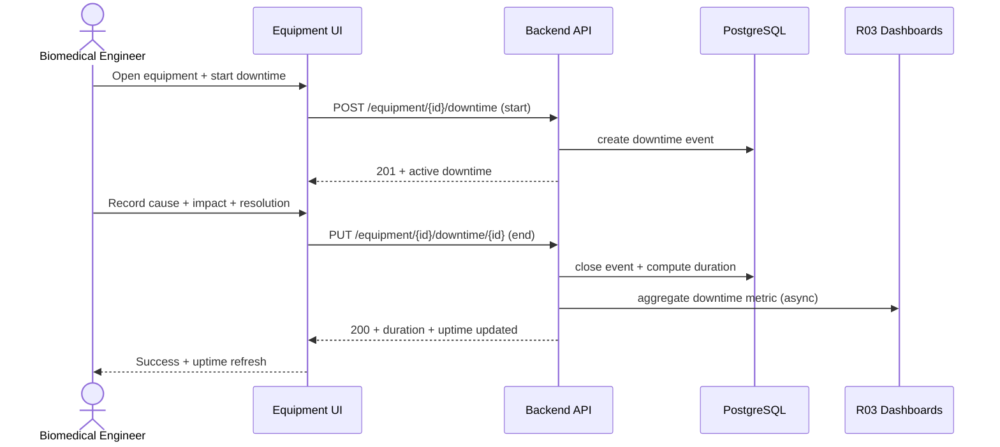
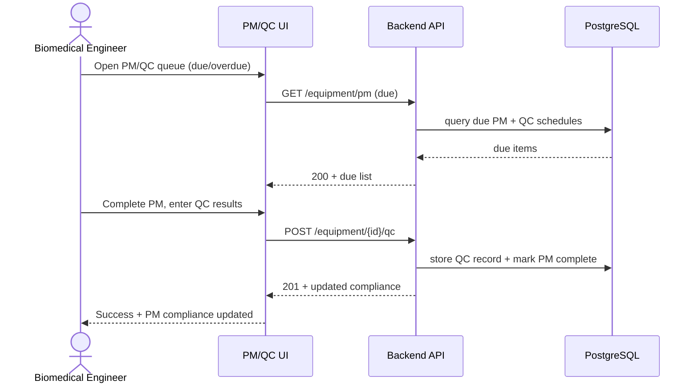

# End-to-End Workflow Maps — Biomedical Engineer (R10)

## Workflow W1: Downtime Logging (frequency: as needed, criticality: high)

### Friction & Cognitive Load Points
- Starting/stopping downtime must be two quick taps — no multi-step wizards.
- Cause categories must be a managed picklist, not free text.

### Error & Exception Paths
- Forgetting to close a downtime event → open-event list with "still running" reminders.
- Concurrent events on the same equipment → validation warning.

## Workflow W2: PM Completion with QC (frequency: daily/weekly, criticality: high)

### Friction & Cognitive Load Points
- QC forms should prefill prior values for comparison.

### Error & Exception Paths
- QC failure → auto-flag equipment status and trigger fault alert (FR-R10-07).
