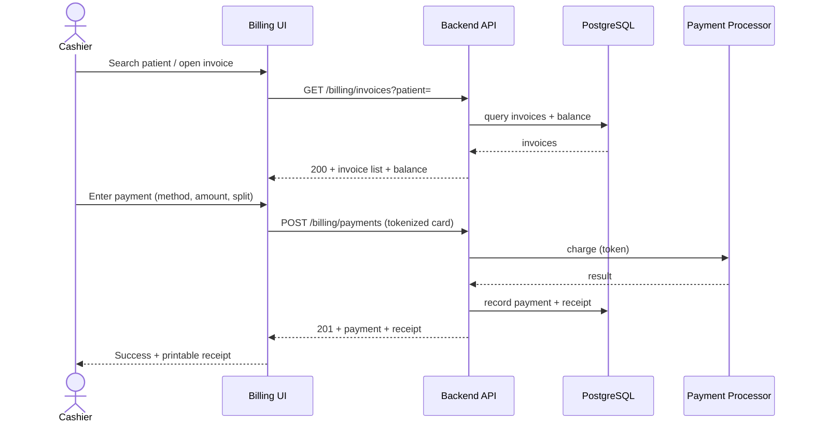
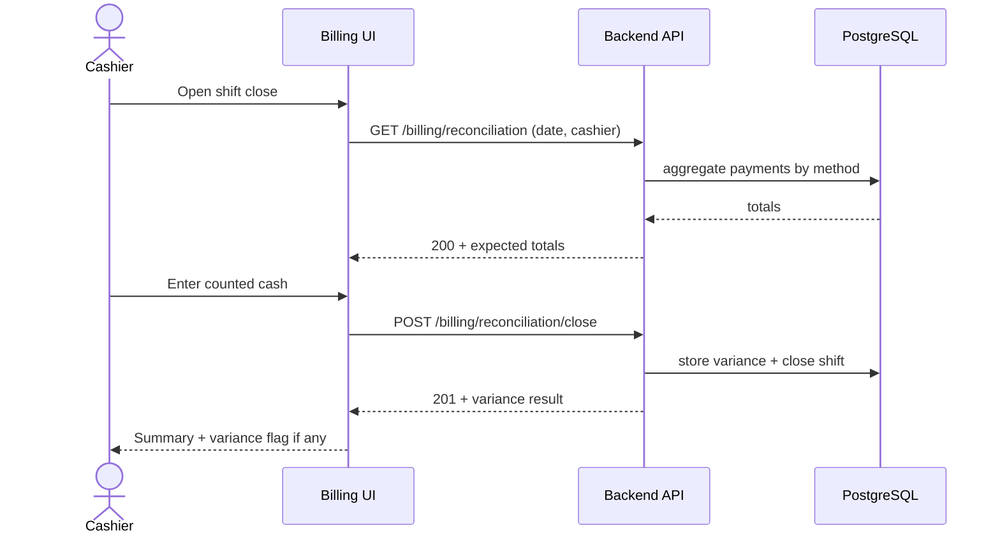

# End-to-End Workflow Maps — Radiology Service Cashier (R09)

## Workflow W1: Payment Collection (frequency: daily, criticality: high)

### Friction & Cognitive Load Points
- Partial/split tenders add cognitive load — guided totals with running balance.
- Denied claims need clear "action required" cues.

### Error & Exception Paths
- Card declined → friendly retry with alternative methods; nothing recorded as paid.
- Double-click submit → idempotency key prevents duplicate charges.
- Print fails → reprint from payment history.

## Workflow W2: End-of-Day Reconciliation (frequency: daily, criticality: high)

### Friction & Cognitive Load Points
- Variance without reason entry forces follow-up — capture reason inline.
