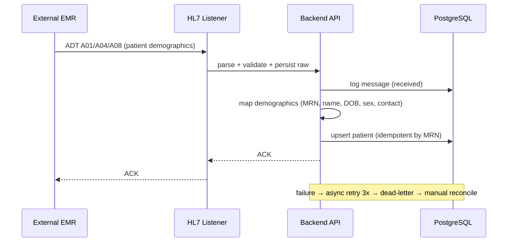

# End-to-End Workflow Maps — External EMR (R16)

## Workflow W1: Demographics Upsert (HL7 ADT) (frequency: continuous, criticality: critical)



### Friction & Cognitive Load Points
- Upsert must be idempotent by MRN — same patient never duplicated.
- Allergy/pregnancy flags must be extracted and available to R11 safety screens.

### Error & Exception Paths
- Unparseable ADT → NAK; message retained.
- Missing MRN → dead-letter with reconciliation UI.

## Workflow W2: Report Delivery (FHIR DiagnosticReport) (frequency: continuous, criticality: high)

```mermaid
sequenceDiagram
    participant API as Backend API
    participant DB as PostgreSQL
    participant FHIR as FHIR Server
    participant EMR as External EMR
    API->>DB: report finalized (R12/R18)
    DB-->>API: event
    API->>FHIR: create DiagnosticReport (patient, imaging study, results)
    FHIR->>EMR: EMR reads DiagnosticReport (subscribed/polled)
    EMR-->>FHIR: 200 read
    FHIR->>DB: mark delivered / log request
    Note over FHIR,EMR: read latency ≤ 200ms p95; failures logged + replayable
```

### Friction & Cognitive Load Points
- Report content mapping to DiagnosticReport components must be deterministic.
- The EMR polls/reads; PACS must expose a stable CapabilityStatement.

### Error & Exception Paths
- EMR not authorized → 401 logged; client config review.
