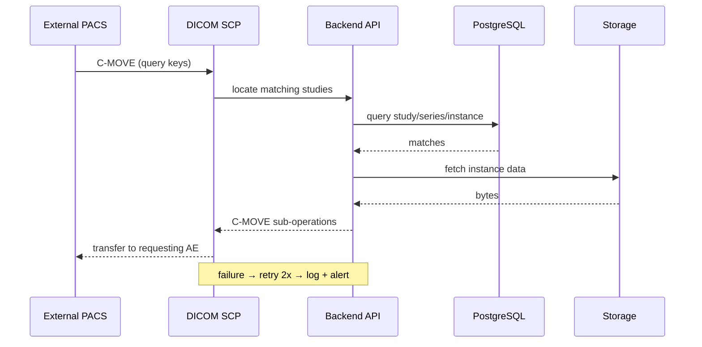

# End-to-End Workflow Maps — External PACS (R17)

## Workflow W1: C-STORE Inbound (frequency: continuous, criticality: critical)

```mermaid
sequenceDiagram
    participant PACS as External PACS
    participant SCP as DICOM SCP
    participant API as Backend API
    participant DB as PostgreSQL
    participant ST as Storage (replicas)
    PACS->>SCP: C-STORE association (instances)
    SCP->>API: parse + validate DICOM
    API->>ST: persist instance (primary replica)
    API->>DB: update study/series/instance records
    API->>API: evaluate routing rules (R17-07)
    API-->>SCP: per-instance status (0x0000 success)
    SCP-->>PACS: C-STORE response
    Note over API,ST: failure → NAK with reason; retry per AE config
```

### Friction & Cognitive Load Points
- Malformed/duplicate instances must not corrupt the study record — dedupe by SOP UID.
- Routing must be evaluated after successful persistence, not before.

### Error & Exception Paths
- Storage write failure → NAK (0xA700/A900) with reason; AE retries.
- Duplicate SOP UID → idempotent success without re-persist.

## Workflow W2: C-MOVE Retrieve (frequency: continuous, criticality: high)



### Friction & Cognitive Load Points
- Large studies: stream sub-operations, do not buffer the whole study in memory.

### Error & Exception Paths
- Requesting AE offline → retry 2x then fail with status logged.
