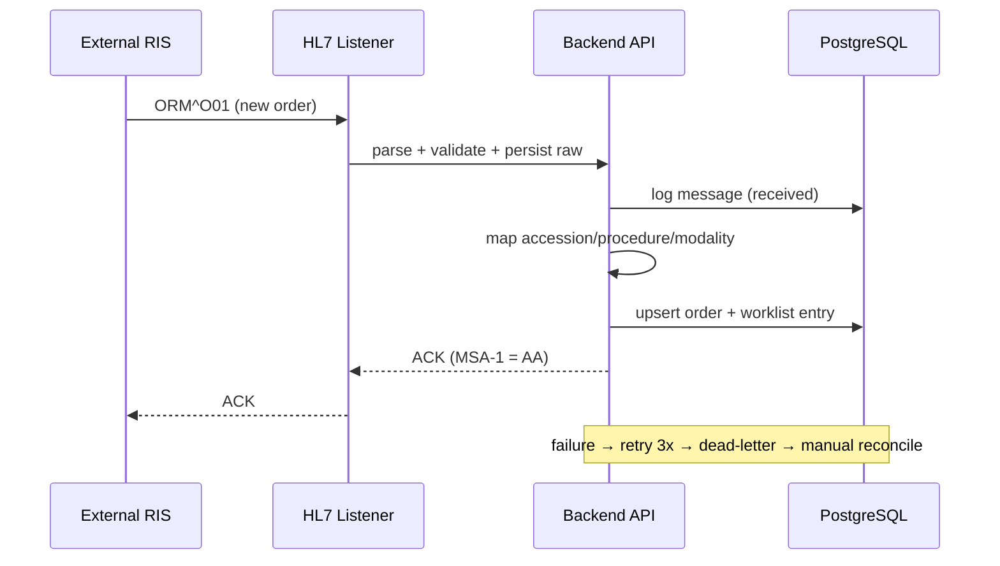
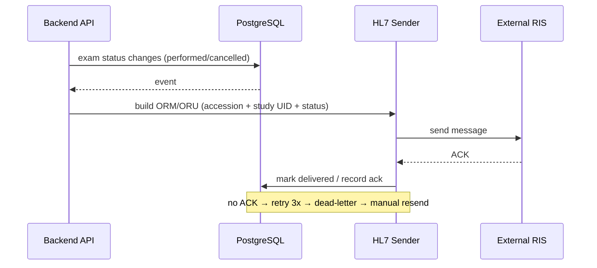

# End-to-End Workflow Maps — External RIS (R15)

## Workflow W1: Order Inbound (HL7 ORM^O01) (frequency: continuous, criticality: critical)

### Friction & Cognitive Load Points
- Duplicate orders (same accession) must merge, not duplicate.
- Unknown modality/AE → quarantine with reason for admin review.

### Error & Exception Paths
- Unparseable message → NAK with error detail; message retained.
- Mapping failure (missing required fields) → dead-letter with reconciliation UI.

## Workflow W2: Status Update Outbound (ORM/ORU) (frequency: continuous, criticality: high)

### Friction & Cognitive Load Points
- Outbound queue must be idempotent (same status event not sent twice).

### Error & Exception Paths
- RIS unavailable → outbound queue backs up; alert when > threshold.
