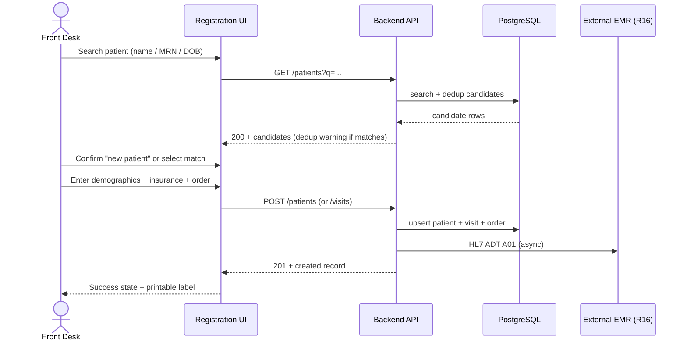
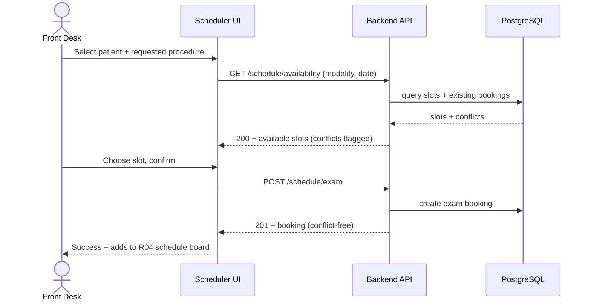

# End-to-End Workflow Maps — Front Desk / Receptionist (R08)

## Workflow W1: Patient Registration with Duplicate Check (frequency: daily, criticality: high)

### Friction & Cognitive Load Points
- Duplicate search requires ≥2 fields before results render — add fuzzy/quick search.
- Insurance entry is form-heavy — progressive disclosure of optional fields.

### Error & Exception Paths
- Search returns no results → allow new registration with a review step.
- ADT sync fails → registration still succeeds; sync retries; queue indicator on patient record.
- Validation error → inline field errors, nothing lost.

## Workflow W2: Appointment Scheduling with Conflict Detection (frequency: daily, criticality: high)

### Friction & Cognitive Load Points
- Slot pickers must show modality + room + technologist, not just time.
- STAT/urgent orders should be visually distinct in the picker.

### Error & Exception Paths
- Slot taken between load and confirm → 409 with refreshed availability.
- No availability → show waitlist option and notify coordinator (R04).
