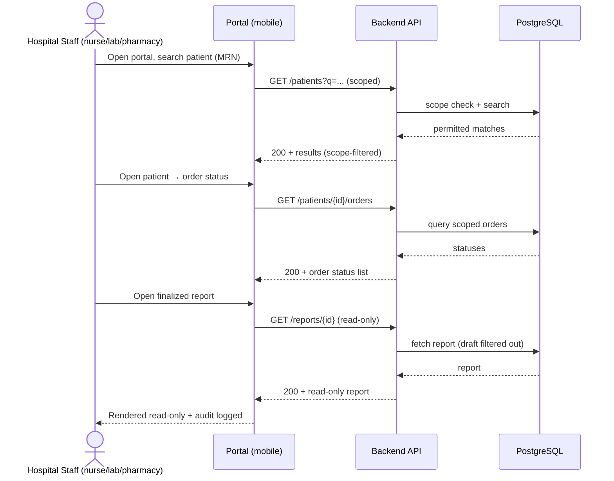
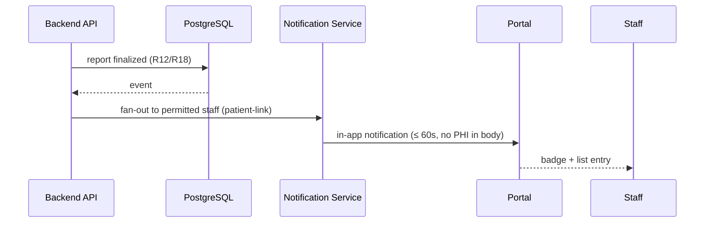

# End-to-End Workflow Maps — Other Hospital Staff (R19)

## Workflow W1: Results Check on Mobile (frequency: daily, criticality: high)

### Friction & Cognitive Load Points
- Scope filtering must be transparent — out-of-scope results simply don't appear.
- Mobile-first layout with readable report rendering.

### Error & Exception Paths
- Out-of-scope access attempt → no data + audit entry.
- Draft-only report → hidden with "not available" messaging.

## Workflow W2: Report Finalize → Notification (frequency: continuous, criticality: high)

### Friction & Cognitive Load Points
- Notification bodies must not contain PHI.

### Error & Exception Paths
- Notification delivery failure → retry; audit of deliveries.
