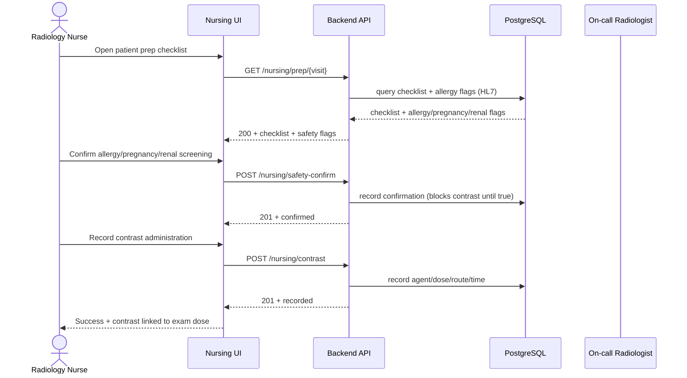
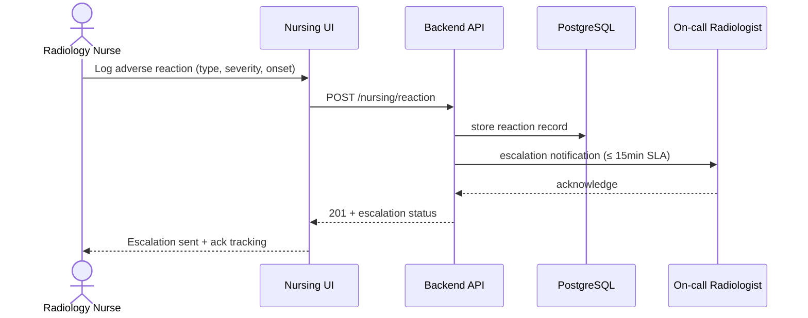

# End-to-End Workflow Maps — Radiology Service Nursing Team (R11)

## Workflow W1: Pre-Contrast Safety + Contrast Administration (frequency: per contrast exam, criticality: critical)

### Friction & Cognitive Load Points
- Safety screening must be a hard gate — contrast action disabled until confirmed.
- Allergy flags from HL7 must be visually prominent.

### Error & Exception Paths
- Allergy flag present → warning banner, contrast requires physician override.
- Adverse reaction → escalation flow (W2).

## Workflow W2: Adverse Reaction Escalation (frequency: as needed, criticality: critical)

### Friction & Cognitive Load Points
- Reaction entry must be < 10 taps (type, severity, onset, actions).

### Error & Exception Paths
- Escalation channel down → retry with fallback (SMS/pager); logged.
