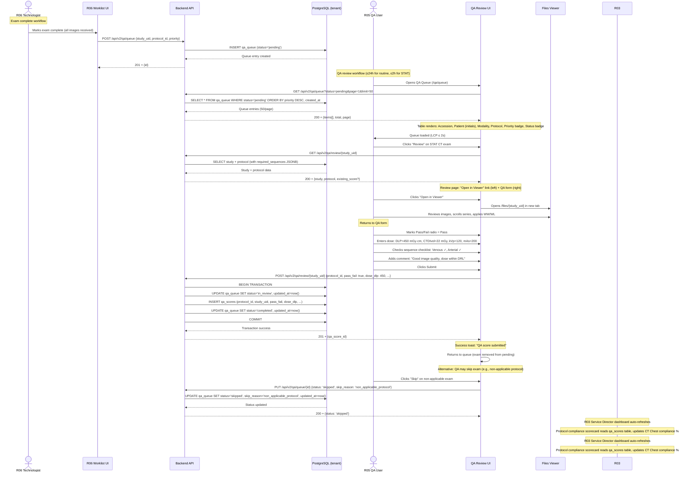
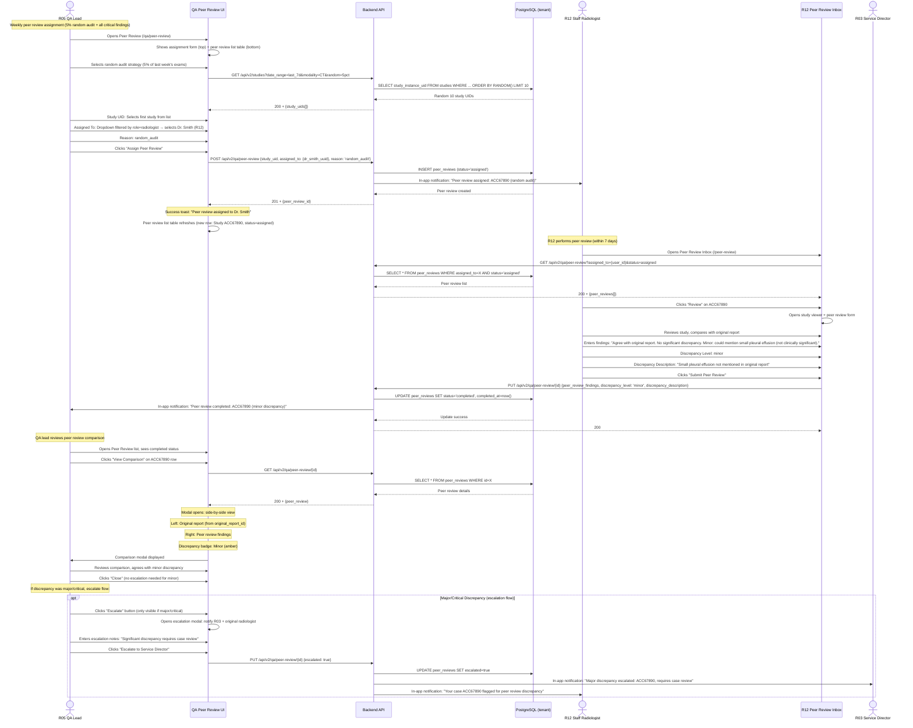

# End-to-End Workflow Maps — Radiology & Imaging Service QI/QA Team (R05)

**Version**: 1.0.0 (v3.0 scope)
**Status**: Final
**Date**: 2026-08-02

---

## Workflow Overview

| Workflow | Trigger | Frequency | Criticality | Primary Integration |
|----------|---------|-----------|-------------|---------------------|
| **W1** Daily QA Review | Continuous (exams enter queue) | Continuous | High | R06 (queue trigger), R03 (data consumer) |
| **W2** Protocol Management | Weekly / on-demand | Weekly | Medium | R03 (dashboard), all modalities |
| **W3** Corrective Action Response | R03 assignment | On-demand | High | R03 (gap analysis) |
| **W4** Incident/Retake Logging | Daily (technologist flag) | Daily | High | R06 (notification) |
| **W5** Peer Review Assignment & Comparison | Weekly (5% random audit) | Weekly | Medium | R12 (peer reviewer) |

---

## W1: Daily QA Review



### Friction & Cognitive Load Points
| Step | Friction | Mitigation |
|------|----------|------------|
| Queue refresh | Manual refresh to see new exams | Auto-refresh ≤1min; WebSocket/SSE for real-time updates (v3.1) |
| Context switching | Switching between viewer tab and QA form | Consider split-screen viewer embed (v3.1); current: new tab acceptable |
| Dose unit entry | Manual numeric entry, typo risk | Input masks with unit suffix; inline validation (≤200ms) |
| Sequence checklist | Must manually check all sequences | Auto-populate from DICOM tags (v3.1 FR-R05-09) |

### Error & Exception Paths
| Error | Detection | Recovery |
|-------|-----------|----------|
| Study not found (404) | On "Open in Viewer" click | Toast error: "Study not available, contact PACS admin"; skip exam button |
| Protocol missing (404) | On queue load | Warning badge on row; allow ad-hoc QA without protocol (comments-only mode) |
| Duplicate QA submission (409) | On submit (queue entry already completed) | Toast warning: "Already reviewed"; reload queue |
| API timeout (>5s) | On submit | Retry button; save draft to localStorage; resume on reconnect |
| Dose validation fail | Inline validation (DLP >1000, negative values) | Red border + error message: "DLP exceeds expected range (0-1000 mGy·cm)" |

---

## W2: Protocol Management

```mermaid
sequenceDiagram
    actor QALead as R05 QA Lead
    participant UI as Protocol Registry UI
    participant API as Backend API
    participant DB as PostgreSQL (tenant)
    actor Director as R03 Service Director

    Note over QALead: Weekly protocol governance (add new protocol)
    QALead->>UI: Opens Protocol Registry (/qa/protocols)
    UI->>API: GET /api/v2/qa/protocols
    API->>DB: SELECT * FROM protocols ORDER BY modality, name
    DB-->>API: Protocol list
    API-->>UI: 200 + {protocols[]}

    Note over UI: Table renders: Code, Name, Modality, Body Part, # Sequences, # Benchmarks, Actions (Edit/Delete)
    UI->>QALead: Protocol registry loaded

    QALead->>UI: Clicks "Add Protocol"
    UI->>UI: Opens modal form

    Note over QALead: Filling form for new CT Chest protocol
    QALead->>UI: Code: CT_CHEST_CONTRAST
    QALead->>UI: Name: CT Chest with IV Contrast
    QALead->>UI: Modality: CT
    QALead->>UI: Body Part: CHEST

    QALead->>UI: Adds Required Sequence #1
    QALead->>UI: Sequence: Venous, Phase: contrast, Contrast: true
    QALead->>UI: Clicks "Add Sequence"
    QALead->>UI: Adds Required Sequence #2
    QALead->>UI: Sequence: Arterial, Phase: contrast, Contrast: true

    QALead->>UI: Adds ACR Benchmark #1
    QALead->>UI: Key: max_dlp_mgycm, Value: 500
    QALead->>UI: Clicks "Add Benchmark"
    QALead->>UI: Adds ACR Benchmark #2
    QALead->>UI: Key: max_ctdivol_mgy, Value: 25

    QALead->>UI: Clicks "Save"
    
    UI->>API: POST /api/v2/qa/protocols {code, name, modality, body_part, required_sequences: [{...}], acr_benchmark: {...}}
    API->>DB: INSERT protocols (required_sequences JSONB, acr_benchmark JSONB)
    DB-->>API: Protocol created
    API-->>UI: 201 + {id}

    Note over UI: Success toast: "Protocol created"; modal closes; table refreshes
    UI->>QALead: New protocol appears in table

    Note over Director: R03 dashboard sees new protocol
    Director->>Director: Opens Protocol Compliance tab (/dashboard/protocol)
    Note over Director: Scorecard now includes CT_CHEST_CONTRAST row (0% compliance initially, no QA scores yet)
```

### Protocol Schema Validation

**`required_sequences` JSONB format**:
```json
[
  {"sequence": "Venous", "phase": "contrast", "contrast": true},
  {"sequence": "Arterial", "phase": "contrast", "contrast": true},
  {"sequence": "Non-contrast", "phase": "pre-contrast", "contrast": false}
]
```

**`acr_benchmark` JSONB format (CT example)**:
```json
{
  "max_dlp_mgycm": 500,
  "max_ctdivol_mgy": 25,
  "min_snr": 10,
  "max_noise_hu": 15
}
```

**`acr_benchmark` JSONB format (MR example)**:
```json
{
  "min_snr": 50,
  "max_ghosting_percent": 5,
  "uniformity_percent": 85
}
```

**`acr_benchmark` JSONB format (Mammography example)**:
```json
{
  "min_contrast_to_noise": 3.5,
  "max_agd_mgy": 3.0,
  "min_resolution_lp_mm": 12
}
```

### Friction & Cognitive Load Points
| Step | Friction | Mitigation |
|------|----------|------------|
| ACR benchmark lookup | Must reference ACR manual for thresholds | Pre-populate common benchmarks by modality (dropdown with defaults) |
| Sequence naming | Inconsistent naming (Venous vs Portal Venous) | Autocomplete from existing sequences; suggest standardization |
| Multi-step form | Long form, risk of losing data on error | Auto-save draft to localStorage; restore on modal reopen |

---

## W3: Corrective Action Response

```mermaid
sequenceDiagram
    actor Director as R03 Service Director
    participant R03UI as R03 Dashboard
    participant API as Backend API
    participant DB as PostgreSQL (tenant)
    actor QA as R05 QA User
    participant QAUI as QA Corrective Actions UI
    actor Tech as R06 Technologist

    Note over Director: R03 identifies protocol gap (78% compliance on CT Chest)
    Director->>R03UI: Clicks "Assign to QA Team" on gap analysis
    R03UI->>API: POST /api/v2/qa/corrective-actions {source: 'R03_director', protocol_id, study_uids: [...], issue_description, assigned_to}
    API->>DB: INSERT corrective_actions (status='open')
    API->>QA: In-app notification: "New corrective action assigned"
    DB-->>API: Corrective action created
    API-->>R03UI: 201 + {id}

    Note over QA: QA receives notification (badge on sidebar)
    QA->>QAUI: Opens Corrective Actions (/qa/actions)
    QAUI->>API: GET /api/v2/qa/corrective-actions?assigned_to={user_id}&status=open
    API->>DB: SELECT * FROM corrective_actions WHERE assigned_to=X AND status='open'
    DB-->>API: Corrective action list
    API-->>QAUI: 200 + {actions[]}

    Note over QAUI: Card list renders: Source badge (R03), Issue, Study count, Assigned date, Status badge (Open)
    QAUI->>QA: Corrective actions loaded

    QA->>QAUI: Clicks "Review" on action card
    QAUI->>QAUI: Expands card (show study UID list + findings textarea + actions textarea)
    
    QA->>QAUI: Clicks study UID link
    QAUI->>Viewer: Opens /files/{study_uid} in new tab (investigates missing sequence)
    QA->>Viewer: Reviews images, identifies missing arterial phase

    Note over QA: Returns to corrective action card
    QA->>QAUI: Enters findings: "Missing arterial phase in 12 of 50 studies. Root cause: Technologist protocol mismatch on Scanner A."
    QA->>QAUI: Enters actions taken: "Retrained technologist on CT Chest protocol. Updated scanner protocol template. Assigned follow-up audit (next 20 exams)."
    QA->>QAUI: Clicks "Resolve"

    QAUI->>API: PUT /api/v2/qa/corrective-actions/{id} {status: 'resolved', findings, actions_taken, resolved_at: now()}
    API->>DB: UPDATE corrective_actions SET status='resolved', resolved_at=now()
    API->>Tech: In-app notification: "Corrective action assigned: CT Chest protocol retraining"
    API->>Director: In-app notification: "Corrective action resolved: CT Chest gap analysis"
    DB-->>API: Update success
    API-->>QAUI: 200

    Note over QAUI: Success toast: "Corrective action resolved"; card moves to "Resolved" tab
    QAUI->>QA: Action resolved, removed from open list
```

### Friction & Cognitive Load Points
| Step | Friction | Mitigation |
|------|----------|------------|
| Study investigation | Must open each study individually to investigate | Batch "Open All Studies" button (opens up to 10 tabs); thumbnail previews in card (v3.1) |
| Root cause analysis | Manual text entry, no structured options | Predefined root cause categories (dropdown: protocol mismatch, equipment failure, training gap, patient factors) + free text |
| Tracking resolution | No automated follow-up audit | Schedule follow-up QA review task (link to qa_queue entry with filter for next 20 exams on Scanner A) |

---

## W4: Incident/Retake Logging

```mermaid
sequenceDiagram
    actor Tech as R06 Technologist
    participant R06UI as R06 Worklist UI
    actor QA as R05 QA User
    participant QAUI as QA Incidents UI
    participant API as Backend API
    participant DB as PostgreSQL (tenant)

    Note over Tech: Technologist identifies retake need (patient motion artifact)
    Tech->>R06UI: Flags exam for retake (in worklist)
    R06UI->>QA: In-app notification: "Retake flagged by technologist: ACC12345"

    Note over QA: QA investigates retake
    QA->>QAUI: Opens Incidents (/qa/incidents)
    QA->>QAUI: Clicks "Log Incident"
    QAUI->>QAUI: Opens incident log form

    QA->>QAUI: Study UID: Search "ACC12345" → autocomplete from studies table
    QAUI->>API: GET /api/v2/studies?accession=ACC12345
    API->>DB: SELECT study_instance_uid FROM studies WHERE accession='ACC12345'
    DB-->>API: Study UID
    API-->>QAUI: 200 + {study_uid}
    QAUI->>QA: Autocomplete fills study_uid field

    QA->>QAUI: Incident Type: patient_motion
    QA->>QAUI: Description: "Patient moved during scan, motion artifact throughout series. Retake performed with immobilization."
    
    Note over QA: Retake already completed
    QA->>QAUI: Repeat Study UID: Search "ACC12345-RETAKE" → autocomplete
    QAUI->>API: GET /api/v2/studies?accession=ACC12345-RETAKE
    API->>DB: SELECT study_instance_uid FROM studies WHERE accession='ACC12345-RETAKE'
    DB-->>API: Repeat study UID
    API-->>QAUI: 200 + {study_uid}
    QAUI->>QA: Autocomplete fills repeat_study_uid field

    QA->>QAUI: Clicks "Submit"
    QAUI->>API: POST /api/v2/qa/incidents {study_uid, repeat_study_uid, incident_type, description}
    API->>DB: INSERT incidents (resolved=false)
    API->>Tech: In-app notification: "Incident logged: Patient motion retake, please review immobilization techniques"
    DB-->>API: Incident created
    API-->>QAUI: 201 + {incident_id}

    Note over QAUI: Success toast: "Incident logged"; form clears
    QAUI->>QA: Incident appears in incidents table

    Note over QA: Marks incident resolved after technologist retraining
    QA->>QAUI: Clicks "Resolve" on incident row
    QAUI->>API: PUT /api/v2/qa/incidents/{id} {resolved: true, resolved_at: now()}
    API->>DB: UPDATE incidents SET resolved=true, resolved_at=now()
    DB-->>API: Update success
    API-->>QAUI: 200

    Note over R03: R03 incident rate metric updates
    Note over R03: Dashboard shows incident count, retake rate
```

### Incident Types & Definitions

| Incident Type | Definition | Retake Required? | Notification |
|---------------|------------|------------------|--------------|
| `positioning` | Patient positioning error (wrong anatomy captured, cut-off) | Usually yes | R06 technologist |
| `artifact` | Image artifact (motion, metal, beam hardening, truncation) | Often yes | R06 technologist |
| `protocol_deviation` | Wrong protocol selected, missing required sequences | Sometimes | R06 tech + QA lead |
| `patient_motion` | Patient moved during scan | Usually yes | R06 technologist |
| `equipment_malfunction` | Scanner hardware/software issue | Maybe (if image quality affected) | R10 Biomed + R06 |
| `contrast_extravasation` | IV contrast extravasation | No (patient safety incident) | Nursing + R03 |

### Friction & Cognitive Load Points
| Step | Friction | Mitigation |
|------|----------|------------|
| Study UID entry | Must know study UID or accession number | Autocomplete search by accession, patient name (last 4 digits MRN), date |
| Linking retake | Retake may not exist yet (logged before repeat performed) | Allow null repeat_study_uid; update later when retake completed |
| Incident trending | No trend analysis by incident type | Dashboard widget (v3.1): incident type breakdown, top modalities with incidents |

---

## W5: Peer Review Assignment & Comparison



### Peer Review Triggers & Reasons

| Reason | Criteria | Frequency |
|--------|----------|-----------|
| `random_audit` | 5% random sample of all completed studies | Weekly |
| `critical_finding` | Studies with critical findings (e.g., pulmonary embolism, pneumothorax) | 100% |
| `trainee_read` | Studies read by radiology residents (R13) | 10% random sample |
| `complaint` | Studies with patient/referring physician complaint | 100% |

### Discrepancy Level Definitions

| Level | Definition | Action Required |
|-------|------------|-----------------|
| `none` | Complete agreement, no discrepancy | None; log for compliance |
| `minor` | Non-clinically significant finding missed or minor wording difference | Log; optional feedback to original reader |
| `major` | Clinically significant finding missed or incorrect diagnosis | Escalate to R03; notify original reader; case review meeting |
| `critical` | Patient safety issue (missed critical finding with immediate treatment implications) | Immediate escalate to R03 + Chief Medical Officer; incident report; mandatory case review |

### Friction & Cognitive Load Points
| Step | Friction | Mitigation |
|------|----------|------------|
| Original report access | Must fetch original report separately | Embed original report in comparison modal (assumes reports table exists in R12 scope) |
| Discrepancy categorization | Subjective judgment (minor vs major) | Guidelines document + examples; second QA reviewer for disputed cases |
| Escalation workflow | Manual notification, no auto-tracking | Auto-create corrective action on escalation; track resolution in corrective_actions table |

---

## Cross-Workflow Integration Summary

| Data Flow | Source | Destination | Frequency | Mechanism |
|-----------|--------|-------------|-----------|-----------|
| Exam completion → QA queue | R06 Technologist | R05 QA Queue | Real-time | `POST /api/v2/qa/queue` from R06 on exam complete |
| QA score → Protocol compliance | R05 QA Score | R03 Dashboard | Real-time (on submit) | `qa_scores` table INSERT; R03 reads on dashboard refresh |
| Gap analysis → Corrective action | R03 Service Director | R05 Corrective Actions | On-demand | `POST /api/v2/qa/corrective-actions` from R03 gap analysis |
| Incident → Technologist notification | R05 Incident Log | R06 Technologist | Real-time (on incident log) | In-app notification via `events:notify` Redis Stream |
| Peer review assignment | R05 QA Lead | R12 Radiologist | Weekly | `POST /api/v2/qa/peer-review`; R12 inbox polls or WebSocket |
| Peer review submission | R12 Radiologist | R05 QA Lead | Within 7 days | `PUT /api/v2/qa/peer-review/{id}`; R05 notification on completion |
| Escalated peer review | R05 QA Lead | R03 Service Director | On major/critical discrepancy | In-app notification + corrective action auto-creation |

---

## HL7 / FHIR Field Mappings

### Inbound Mappings (R15 RIS → R05 QA)

| Source System | Source Field | HL7 Segment/Field | FHIR Resource/Field | R05 Target Field | Direction |
|---------------|-------------|-------------------|---------------------|------------------|-----------|
| R15 RIS | Exam accession number | MSH-10 (Message Control ID) | `Encounter.identifier` | `qa_queue.study_uid` | Inbound |
| R15 RIS | Patient MRN | PID-3 (Patient Identifier List) | `Patient.identifier` | `qa_queue.patient_mrn` | Inbound |
| R15 RIS | Patient name | PID-5 (Patient Name) | `Patient.name` | `qa_queue.patient_name` (initials only) | Inbound |
| R15 RIS | Patient DOB | PID-7 (Date/Time of Birth) | `Patient.birthDate` | `qa_queue.patient_dob` | Inbound |
| R15 RIS | Modality | IN1-12 (Industry Code) | `Encounter.class` | `qa_queue.modality` | Inbound |
| R15 RIS | Protocol name | ORC-18 (Filler Order Number) | `Encounter.type` | `qa_queue.protocol_id` | Inbound |
| R15 RIS | Scheduled date/time | SCH-2 (Start Date/Time) | `Encounter.period.start` | `qa_queue.scheduled_date` | Inbound |
| R15 RIS | Priority (routine/STAT) | ORC-5 (Order Priority) | `Encounter.priority` | `qa_queue.priority` | Inbound |
| R15 RIS | Performing modality | A18-1 (Modality) | `Encounter.participant.type` | `qa_queue.modality` | Inbound |
| R15 RIS | Series Instance UID | OBX-18 (Filler Order Number) | `Encounter.identifier` | `qa_queue.series_uid` | Inbound |
| R15 RIS | Study Instance UID | RXE-2 (Give Drug) | `Encounter.identifier` | `qa_queue.study_uid` | Inbound |

### Inbound Mappings (R16 EMR → R05 QA)

| Source System | Source Field | FHIR Resource/Field | R05 Target Field | Direction |
|---------------|-------------|---------------------|------------------|-----------|
| R16 EMR | Patient demographics | `Patient` resource | `qa_queue.patient_*` | Inbound |
| R16 EMR | Encounter context | `Encounter` resource | `qa_queue.encounter_id` | Inbound |
| R16 EMR | Order context | `ServiceRequest` resource | `qa_queue.protocol_id` | Inbound |
| R16 EMR | Practitioner (ordering) | `Practitioner` resource | `qa_queue.ordering_physician` | Inbound |
| R16 EMR | Location (department) | `Location` resource | `qa_queue.department` | Inbound |

### Reverse Mappings (R05 QA → R15 RIS / R16 EMR)

| R05 Source | R05 Field | Target System | Target Field | Direction |
|------------|-----------|---------------|-------------|-----------|
| `qa_scores` | `pass_fail` | R15 RIS | ORC-21 (Order Status) = 'CA' (completed) or 'CM' (in progress) | Reverse |
| `qa_scores` | `dose_dlp` | R16 EMR | `Observation` (dose) resource | Reverse |
| `qa_scores` | `dose_ctdivol` | R16 EMR | `Observation` (CTDIvol) resource | Reverse |
| `qa_scores` | `dose_kvp` | R16 EMR | `Observation` (kVP) resource | Reverse |
| `qa_scores` | `dose_mas` | R16 EMR | `Observation` (mAs) resource | Reverse |
| `qa_scores` | `protocol_id` | R15 RIS | ORC-18 (Filler Order Number) | Reverse |
| `qa_scores` | `reviewed_by` | R16 EMR | `Practitioner` reference | Reverse |
| `qa_scores` | `reviewed_at` | R15 RIS | OBX-19 (Date/Time of Observation) | Reverse |
| `incidents` | `incident_type` | R16 EMR | `DetectedIssue` resource | Reverse |
| `incidents` | `severity` | R16 EMR | `DetectedIssue.severity` | Reverse |
| `incidents` | `repeat_study_uid` | R15 RIS | ORC-18 (new order for repeat) | Reverse |
| `corrective_actions` | `status` | R15 RIS | ORC-21 (Order Status) | Reverse |
| `peer_reviews` | `discrepancy_level` | R15 RIS | OBX-11 (Observation Result Status) | Reverse |
| `peer_reviews` | `discrepancy_type` | R16 EMR | `DetectedIssue.category` | Reverse |

### Field Mapping Notes

- **Patient initials**: R05 displays only patient initials (not full name) per HIPAA minimum necessary access principle. Full name is available to authorized roles only.
- **Dose fields**: DLP, CTDIvol, kVp, and mAs are mapped bidirectionally — R15 RIS provides the values on inbound, R05 QA validates against protocol benchmarks, and R05 writes back validated values to R16 EMR.
- **Protocol ID**: The `protocol_id` in R05 corresponds to the R15 RIS order entry protocol. Reverse mapping updates the RIS order status to reflect QA completion.
- **Repeat study**: When an incident is logged with `repeat_study_uid`, the reverse mapping creates a new RIS order (ORC segment) for the repeat study.
- **HL7 v2.x**: All inbound mappings use HL7 v2.5.1 message types (ORM^O01 for orders, ADT^A01 for admissions, ORU^R01 for results).
- **FHIR R4**: All EMR mappings use FHIR R4 resources. The `Encounter` resource links exams to protocols and patients.