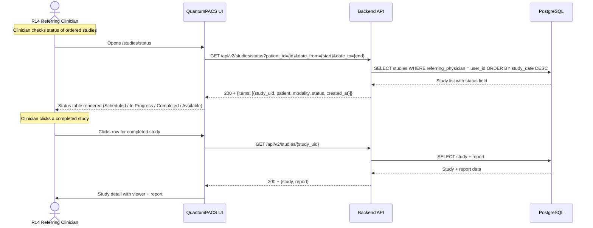

# End-to-End Workflow Maps — Referring Clinician (R14)

**Version**: 1.0.0 (v3.0 scope)
**Status**: Final
**Date**: 2026-08-02

---

## Workflow W1: Share-Link Study Access (frequency: daily, criticality: high)

```mermaid
sequenceDiagram
    actor Sender as R08/R12 (Sender)
    participant UI as QuantumPACS UI
    participant API as Backend API
    participant DB as PostgreSQL
    actor Clinician as R14 Referring Clinician
    participant Viewer as Cornerstone3D Viewer

    Note over Sender: R08 or R12 creates share link
    Sender->>UI: Clicks "Share Study" on study detail
    UI->>API: POST /api/v2/files/{id}/share {duration: 7d}
    API->>DB: INSERT shared_files (file_id, key, expires_at)
    DB-->>API: 201 + {share_key, expires_at}
    API-->>UI: 201 + {share_url: /share/{key}}
    UI-->>Sender: Share URL copied to clipboard

    Note over Clinician: Clinician receives share link via email/portal
    Clinician->>UI: Opens /share/{key} in browser
    UI->>API: GET /api/v2/share/{key}
    API->>DB: SELECT * FROM shared_files WHERE key={key} AND expires_at > now()
    DB-->>API: shared_files record (or 404 if expired/invalid)
    alt Share link valid
        API-->>UI: 200 + {study_uid, patient_initials, modality, report_url}
        UI->>API: GET /api/v2/studies/{study_uid}
        API->>DB: SELECT study + series + instances
        DB-->>API: Study metadata + DICOM URLs
        API-->>UI: 200 + {study, series[], report}
        UI->>Viewer: Renders Cornerstone3D viewer (read-only)
        Viewer-->>Clinician: Images displayed (scroll, WW/WL, zoom, pan)
        UI->>Clinician: Report panel rendered (read-only)
        Note over Clinician: View images and report; no annotation or save
    else Share link expired or invalid
        API-->>UI: 404 + {error: "Share link expired or invalid"}
        UI-->>Clinician: Error page with "Request new link" CTA
    end
```

### Friction & Cognitive Load Points
- Step 3: Share link creation requires R08/R12 to copy URL — add "copy to clipboard" button to reduce friction
- Step 6: Clinician sees error page for expired links — provide clear "Request new link" CTA
- Step 8: Read-only viewer may confuse clinicians used to annotation-capable viewers — show "View Only" badge

### Error & Exception Paths
- **Expired share link (404)**: Show friendly error page with "Request new link" button that sends notification to R08/R12
- **Invalid share key (404)**: Same as expired; do not reveal whether key format is valid
- **Study not found (404)**: Show "Study no longer available" message; do not reveal if study exists
- **Rate limit exceeded (429)**: Show "Too many requests" message with Retry-After header
- **SSO login failure**: Redirect to login page with error message; allow retry

---

## Workflow W2: SSO Login and Study Access (frequency: daily, criticality: high)

```mermaid
sequenceDiagram
    actor Clinician as R14 Referring Clinician
    participant UI as QuantumPACS UI
    participant API as Backend API
    participant IdP as Identity Provider (Azure AD/Okta)
    participant DB as PostgreSQL
    participant Viewer as Cornerstone3D Viewer

    Note over Clinician: Clinician navigates to PACS URL or clicks SSO link
    Clinician->>UI: Navigates to /login/sso (or clicks SSO button)
    UI->>IdP: Redirect to SAML/OIDC authorization endpoint
    IdP-->>Clinician: IdP login page (enterprise credentials)
    Clinician->>IdP: Enters credentials
    IdP-->>UI: SAML/OIDC assertion (JWT)
    UI->>API: POST /api/v2/auth/sso {assertion}
    API->>API: Validate JWT with IdP public key
    API->>DB: Lookup user by SSO subject; assign `referring_physician` role
    DB-->>API: User record + role
    API-->>UI: 200 + {token, user: {role: 'referring_physician'}}
    UI-->>Clinician: Redirect to /studies (read-only dashboard)

    Note over Clinician: Clinician views their referred studies
    Clinician->>UI: Views study list (ordered by date, filtered to referred)
    UI->>API: GET /api/v2/studies?role=referring_physician&page=1&limit=25
    API->>DB: SELECT studies where referring_physician = user_id OR shared via link
    DB-->>API: Paginated study list
    API-->>UI: 200 + {items[], total, page}
    UI-->>Clinician: Study list rendered (read-only)

    Clinician->>UI: Clicks a study to view
    UI->>API: GET /api/v2/studies/{study_uid}
    API->>DB: SELECT study + series + report
    DB-->>API: Study data + report
    API-->>UI: 200 + {study, report}
    UI->>Viewer: Renders Cornerstone3D viewer (read-only)
    Viewer-->>Clinician: Images displayed (scroll, WW/WL, zoom, pan)
    UI->>Clinician: Report panel rendered (read-only)
```

### Friction & Cognitive Load Points
- Step 4: SSO redirect adds one extra hop — IdP latency should be ≤ 3s
- Step 10: Study list is filtered to referred studies only — clinician should not see unrelated studies
- Step 14: Read-only viewer — no annotation tools visible; "View Only" badge prominent

### Error & Exception Paths
- **SSO assertion invalid**: Return 401; redirect to login with "Authentication failed" message
- **User not found in PACS**: Return 403; show "Access not provisioned. Contact your PACS administrator."
- **No studies found**: Show empty state with "No referred studies found" message
- **SSO IdP unavailable**: Show "Identity provider is temporarily unavailable" with retry option

---

## Workflow W3: Study Status Tracking (frequency: daily, criticality: medium)



### Friction & Cognitive Load Points
- Step 3: Status table must be sortable by date and status — default sort by most recent
- Step 7: "Completed" status should link directly to viewer — no extra click needed

### Error & Exception Paths
- **No studies found**: Show empty state with "No studies found for the selected filters" message
- **Date range too large**: Cap at 90 days; show warning if range exceeds 90 days
- **Database timeout**: Show "Loading..." spinner with retry button; timeout after 10s

---

## Workflow W4: Results Notification (frequency: daily, criticality: high)

```mermaid
sequenceDiagram
    participant System as QuantumPACS System
    actor Clinician as R14 Referring Clinician
    participant UI as QuantumPACS UI
    participant API as Backend API
    participant DB as PostgreSQL

    Note over System: R06/R07 completes exam; R12 signs report
    R12->>API: PUT /api/v2/reports/{id} {status: 'signed', content: ...}
    API->>DB: UPDATE reports SET status='signed', signed_at=now()
    DB-->>API: Report updated
    API->>System: Trigger notification events

    Note over System: System generates notifications for referring clinician
    System->>API: POST /api/v2/notifications {user_id, type: 'report_available', study_uid, summary}
    API->>DB: INSERT notifications (user_id, type, study_uid, summary, read=false)
    DB-->>API: Notification created
    API-->>System: 201 + {notification_id}

    System->>Clinician: Email notification (if email enabled)
    System->>Clinician: In-app notification (bell icon badge)

    Note over Clinician: Clinician checks notifications
    Clinician->>UI: Clicks notification bell
    UI->>API: GET /api/v2/notifications?unread=true
    API->>DB: SELECT * FROM notifications WHERE user_id=X AND read=false
    DB-->>API: Unread notifications
    API-->>UI: 200 + {notifications[]}
    UI-->>Clinician: Notification dropdown rendered

    Clinician->>UI: Clicks notification for study
    UI->>API: GET /api/v2/studies/{study_uid}
    API->>DB: SELECT study + report
    DB-->>API: Study + report
    API-->>UI: 200 + {study, report}
    UI->>Clinician: Study viewer + report opened
```

### Friction & Cognitive Load Points
- Step 7: Email notification must include enough context (modality, study description, report summary) — don't make clinician click to see what it's about
- Step 12: Notification badge count must be accurate — update on mark-as-read
- Step 15: Report summary in notification should be truncated to 200 chars with "View full report" link

### Error & Exception Paths
- **Email delivery failure**: Retry 3x with exponential backoff; log failure; show in-app notification as fallback
- **Notification API error**: Show toast "Notifications temporarily unavailable"
- **Report not yet signed**: Show "Report pending radiologist review" status

---

## Workflow W5: Follow-Up Request (frequency: occasional, criticality: medium)

```mermaid
sequenceDiagram
    actor Clinician as R14 Referring Clinician
    participant UI as QuantumPACS UI
    participant API as Backend API
    participant DB as PostgreSQL
    actor Radiologist as R12 Staff Radiologist

    Note over Clinician: Clinician wants to request follow-up imaging
    Clinician->>UI: Opens study detail; clicks "Request Follow-Up"
    UI->>API: GET /api/v2/studies/{study_uid}/followup-template
    API->>DB: SELECT protocol + clinical_indications
    DB-->>API: Template data
    API-->>UI: 200 + {template}
    UI-->>Clinician: Follow-up request form rendered (pre-filled)

    Clinician->>UI: Fills in clinical indication, urgency, requested modality
    Clinician->>UI: Clicks "Submit Request"
    UI->>API: POST /api/v2/studies/{study_uid}/followup-request {urgency, modality, indication}
    API->>DB: INSERT followup_requests (study_uid, requesting_clinician, urgency, modality, indication, status='open')
    DB-->>API: Follow-up request created
    API-->>UI: 201 + {request_id}
    API->>System: Notify R12 radiologist (in-app + email)
    UI-->>Clinician: Confirmation toast: "Follow-up request submitted"

    Note over Radiologist: R12 radiologist receives follow-up request
    Radiologist->>UI: Opens follow-up request queue
    UI->>API: GET /api/v2/followup-requests?assigned_to={user_id}&status=open
    API->>DB: SELECT * FROM followup_requests WHERE status='open'
    DB-->>API: Open requests
    API-->>UI: 200 + {requests[]}
    UI-->>Radiologist: Request list rendered

    Radiologist->>UI: Reviews request; approves or rejects
    Radiologist->>UI: Clicks "Approve" or "Reject"
    UI->>API: PUT /api/v2/followup-requests/{id} {status: 'approved'|'rejected', notes}
    API->>DB: UPDATE followup_requests SET status='approved', reviewed_by=user_id, reviewed_at=now()
    DB-->>API: Request updated
    API-->>UI: 200 + {request}
    API->>System: Notify R14 clinician of decision
    UI-->>Radiologist: Request marked as approved/rejected

    Note over Clinician: Clinician receives notification of decision
    Clinician->>UI: Checks notification; sees "Follow-up approved" or "Follow-up rejected"
```

### Friction & Cognitive Load Points
- Step 3: Pre-filled template reduces data entry — include clinical indication dropdown from protocol
- Step 10: Radiologist queue must be separate from reading worklist — don't mix follow-up requests with active reads
- Step 18: Clinician notification must include the decision and any radiologist notes

### Error & Exception Paths
- **Follow-up request API error**: Show toast "Request could not be submitted. Please try again."
- **Radiologist rejects**: Show rejection reason; allow clinician to revise and resubmit
- **No radiologist available**: Queue request; notify when radiologist becomes available

---

## Cross-Workflow Integration Summary

| Data Flow | Source | Destination | Frequency | Mechanism |
|-----------|--------|-------------|-----------|-----------|
| Share link creation | R08/R12 | R14 Clinician | On-demand | `POST /api/v2/files/{id}/share`; email/portal delivery |
| Share link access | R14 Clinician | Viewer + Report | Per access | `GET /api/v2/share/{key}`; read-only |
| SSO authentication | R14 Clinician | PACS | Per login | SAML/OIDC assertion; JWT issuance |
| Study status update | R06/R07 (technologist) | R14 Clinician | Real-time | Exam completion event → notification |
| Report availability | R12 Radiologist | R14 Clinician | On sign-off | Report signed → notification (email + in-app) |
| Follow-up request | R14 Clinician | R12 Radiologist | On-demand | `POST /api/v2/followup-request`; notification |
| Follow-up decision | R12 Radiologist | R14 Clinician | On review | `PUT /api/v2/followup-request/{id}`; notification |
| Critical findings alert | R12 Radiologist | R14 Clinician | On flag | In-app notification + prominent alert |