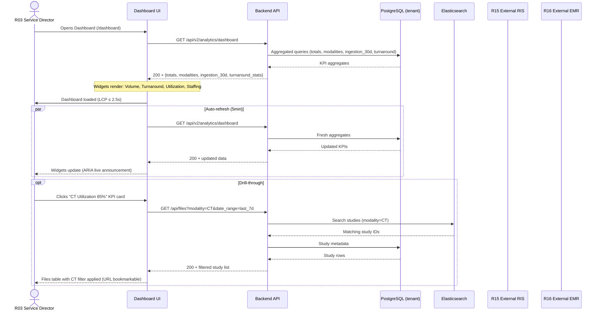
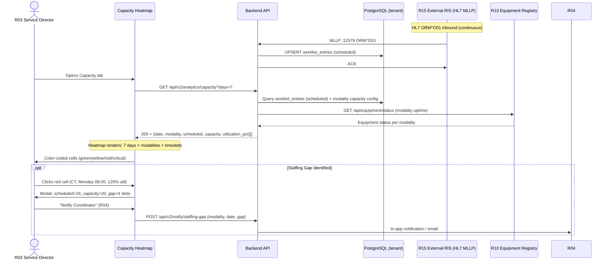
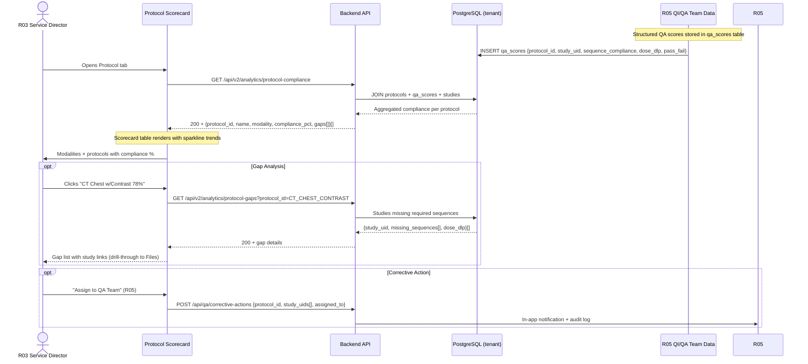

# End-to-End Workflow Maps — Radiology Service Director (R03)

**Version**: 1.0.0 (v3.0 scope)
**Status**: Final
**Date**: 2026-08-02

---

## Workflow Overview

| Workflow | Trigger | Frequency | Criticality | Primary Integration |
|----------|---------|-----------|-------------|---------------------|
| **W1** Daily KPI Review | 07:00 login | Daily | High | R15 (HL7 ORM), R16 (FHIR Patient) |
| **W2** Capacity & Staffing Check | 07:30 daily huddle | Daily | High | R15 (HL7 ORM), R10 (Equipment) |
| **W3** Protocol QA Review | Friday 14:00 | Weekly | Medium | R05 (QA Scores), DICOM tags |
| **W4** Monthly Board Report | 1st of month | Monthly | High | All (aggregated) |

---

## W1: Daily KPI Review



### Friction & Cognitive Load Points
| Step | Friction | Mitigation |
|------|----------|------------|
| Dashboard load | Multiple widget API calls sequential | Parallel fetch via `Promise.all` |
| Auto-refresh | No visual indicator of data age | "Last updated: 2min ago" timestamp per widget |
| Drill-through | Context loss (which KPI triggered filter) | Breadcrumb shows "Dashboard > CT Utilization" |
| ES unavailable | Search falls back to PostgreSQL (slow) | Graceful degradation per `UX-Functionality.md` |

### Error & Exception Paths
| Error | Detection | Recovery |
|-------|-----------|----------|
| API timeout (>5s) | Frontend timeout | Retry button on widget; toast notification |
| ES down | Search returns empty | Fallback to PostgreSQL query; warning banner |
| Tenant DB unreachable | Health check fails | Redirect to `/health`; show system status |
| Auth token expired | 401 on API call | Silent refresh via refresh token; redirect to login if failed |

---

## W2: Capacity & Staffing Check



### HL7 ORM^O01 Field Mapping (Inbound: RIS → PACS)

| HL7 Segment | Field | Component | Maps To (PACS) | Notes |
|-------------|-------|-----------|----------------|-------|
| **MSH** | MSH.9 | Message Type | `ORM^O01` | Trigger: new order |
| **MSH** | MSH.10 | Message Control ID | `hl7_messages.msg_control_id` | Deduplication |
| **PID** | PID.3 | Patient ID List | `patients.patient_id` | Primary key; MRN |
| **PID** | PID.5 | Patient Name | `patients.patient_name` | Last^First^Middle^Suffix^Prefix |
| **PID** | PID.7 | Birth Date | `patients.birth_date` | YYYYMMDD |
| **PID** | PID.8 | Sex | `patients.sex` | M/F/O |
| **PID** | PID.11 | Patient Address | `patients.address` | Optional |
| **PID** | PID.18 | Patient Account # | `patients.account_number` | Billing ref |
| **ORC** | ORC.1 | Order Control | `NW` (new) / `CA` (cancel) | Status mapping |
| **ORC** | ORC.2 | Placer Order # | `worklist_entries.accession_number` | **Accession number** |
| **ORC** | ORC.3 | Filler Order # | `worklist_entries.filler_order_number` | PACS study UID |
| **ORC** | ORC.5 | Order Status | `worklist_entries.status` | NW→scheduled, CA→cancelled |
| **ORC** | ORC.12 | Ordering Provider | `worklist_entries.ordering_provider` | Referring physician |
| **OBR** | OBR.2 | Placer Order # | `worklist_entries.accession_number` | Duplicate of ORC.2 |
| **OBR** | OBR.3 | Filler Order # | `worklist_entries.filler_order_number` | |
| **OBR** | OBR.4 | Universal Service ID | `worklist_entries.procedure_code` | Modality + body part (e.g., `CT^CHEST^W^CONTRAST`) |
| **OBR** | OBR.16 | Ordering Provider | `worklist_entries.ordering_provider` | Referring physician |
| **OBR** | OBR.27 | Scheduled Date/Time | `worklist_entries.scheduled_datetime` | **YYYYMMDDHHMMSS** |
| **OBR** | OBR.31 | Reason for Study | `worklist_entries.clinical_indication` | Clinical context |
| **OBR** | OBR.34 | Technologist | `worklist_entries.assigned_technologist` | Optional |

### Reverse Mapping: PACS → RIS (Study Status Updates)

| PACS Event | HL7 Message | Key Fields | Trigger |
|------------|-------------|------------|---------|
| **Study Performed** (C-STORE received) | `ORM^O01` (status update) / `OML^O21` | ORC.1=`SC`, ORC.2=accession, ORC.3=study_uid, OBR.27=performed_datetime, OBR.25=status (`P`=performed) | First instance of study received |
| **Study Cancelled** (worklist cancelled) | `ORM^O01` | ORC.1=`CA`, ORC.2=accession, ORC.3=filler_order_number | Manual cancel in worklist |
| **Study Completed** (report signed) | `ORU^R01` (results) | OBR.2=accession, OBX.5=report_text, OBX.14=report_datetime | Report sign-off (R12) |
| **Modality Worklist Query** | `C-FIND` (DICOM MWL) | Returns scheduled procedures | Modality queries MWL |

**HL7 ORM^O01 Status Update Example (Study Performed):**
```
MSH|^~\&|QUANTUMPACS|HOSPITAL|RIS|HOSPITAL|20260802120000||ORM^O01|MSG12345|P|2.5
PID|1||12345^^^HOSPITAL^MRN||DOE^JOHN^^^^^L||19800101|M|||123 MAIN ST^^CITY^^12345||555-1234|||S
ORC|SC|ACC12345|STUDY_UID_1.2.3||||||20260802120000|^PERFORMING_PHYSICIAN
OBR|1|ACC12345|STUDY_UID_1.2.3|CT^CHEST^W^CONTRAST||20260802120000|||||||^PERFORMING_PHYSICIAN|||||||||P|^^^^^CT01
```

### FHIR R4 Patient Field Mapping (Inbound: EMR → PACS)

| FHIR Path | PACS Field | Notes |
|-----------|------------|-------|
| `Patient.identifier[system=urn:oid:1.2.3.4.5].value` | `patients.patient_id` | MRN system |
| `Patient.name[0].family` | `patients.patient_name` (last) | |
| `Patient.name[0].given[0]` | `patients.patient_name` (first) | |
| `Patient.birthDate` | `patients.birth_date` | YYYY-MM-DD |
| `Patient.gender` | `patients.sex` | male→M, female→F, other→O |
| `Patient.address[0].line[0]` | `patients.address` | Optional |
| `Patient.telecom[system=phone].value` | `patients.phone` | Optional |

### Reverse Mapping: PACS → EMR (FHIR ImagingStudy)

| PACS Event | FHIR Resource | Key Fields |
|------------|---------------|------------|
| Study created | `ImagingStudy` (create) | `identifier`=accession, `subject`=Patient/ref, `modality`=code, `started`=study_datetime, `procedureCode`=proc_code |
| Study updated | `ImagingStudy` (update) | `status`=`available`, `numberOfSeries`, `numberOfInstances` |
| Report signed | `DocumentReference` (create) | `subject`=Patient/ref, `context`=ImagingStudy/ref, `content.attachment`=report_pdf, `date`=signed_datetime |

---

## W3: Protocol QA Review



### Protocol Registry Schema (Required for v3.0)

```sql
CREATE TABLE protocols (
    id              UUID PRIMARY KEY DEFAULT gen_random_uuid(),
    protocol_code   VARCHAR(50) UNIQUE NOT NULL,  -- e.g., 'CT_CHEST_CONTRAST'
    name            VARCHAR(200) NOT NULL,        -- 'CT Chest with Contrast'
    modality        VARCHAR(20) NOT NULL,         -- 'CT', 'MR', 'US', etc.
    body_part       VARCHAR(50),                  -- 'CHEST', 'BRAIN', 'ABDOMEN'
    required_sequences JSONB NOT NULL,             -- [{"sequence": "Venous", "phase": "contrast"}, ...]
    acr_benchmark   JSONB,                        -- {"max_dlp": 500, "min_snr": 10}
    created_at      TIMESTAMPTZ DEFAULT now(),
    updated_at      TIMESTAMPTZ DEFAULT now()
);

CREATE TABLE qa_scores (
    id                  UUID PRIMARY KEY DEFAULT gen_random_uuid(),
    protocol_id         UUID REFERENCES protocols(id),
    study_uid           VARCHAR(100) NOT NULL,
    sequence_compliance JSONB,                     -- {"Venous": true, "Arterial": false}
    dose_dlp            NUMERIC,                    -- Dose Length Product
    dose_ctdivol        NUMERIC,                    -- CTDIvol
    pass_fail           BOOLEAN NOT NULL,
    reviewed_by         UUID REFERENCES users(id),
    reviewed_at         TIMESTAMPTZ,
    created_at          TIMESTAMPTZ DEFAULT now()
);
```

---

## W4: Monthly Board Report

```mermaid
sequenceDiagram
    actor Director as R03 Service Director
    participant UI as Report Builder
    participant API as Backend API
    participant DB as PostgreSQL (tenant)
    participant Storage as S3/Local Backend
    participant Email as SMTP/Email Service

    Director->>UI: Opens Report Builder (1st of month)
    UI->>API: GET /api/v2/reports/templates
    API->>DB: SELECT * FROM report_templates WHERE enabled=true
    DB-->>API: 5 templates
    API-->>UI: 200 + template list

    Director->>UI: Selects "Monthly Volume Summary" (tpl-01)
    UI->>UI: Opens parameter modal: date_range=last_month, modality=all
    Director->>UI: Clicks "Generate PDF"
    UI->>API: POST /api/v2/reports/generate {template_id: "tpl-01", params: {...}, format: "pdf"}
    API->>DB: Execute template query (aggregated volume by modality/day)
    API->>Storage: Stream PDF generation (server-side, puppeteer/chromium)
    API-->>UI: 200 + streamed PDF (Content-Disposition: attachment)
    UI-->>Director: PDF downloads; "Report generated in 42s" toast

    opt Schedule for Auto-Delivery (v3.1)
        Director->>UI: "Schedule monthly email to leadership"
        UI->>API: POST /api/v2/reports/schedule {template_id, params, cron, recipients[]}
        API->>DB: INSERT report_schedules
        API-->>UI: 201 + schedule_id
    end

    Note over API: Audit log entry
    API->>DB: INSERT dashboard_audit {user_id, action: 'report_generate', template_id, format, timestamp}
```

### Report Templates (v3.0 — 5 Pre-defined)

| Template ID | Name | Parameters | Query Summary |
|-------------|------|------------|---------------|
| `tpl-01` | Monthly Volume Summary | `date_range`, `modality[]` | Studies per day × modality; totals |
| `tpl-02` | Turnaround by Modality | `date_range`, `stat_routine` | p50/p95 turnaround × modality |
| `tpl-03` | Protocol Compliance | `modality`, `protocol[]` | Compliance % × protocol; gap count |
| `tpl-04` | Capacity Utilization | `date_range`, `modality[]` | Scheduled vs capacity × day × modality |
| `tpl-05` | SLA Breach Detail | `date_range`, `severity[]` | Breach list: study, modality, minutes over, role |

---

## Cross-Workflow Integration Summary

| Data Flow | Source | Destination | Frequency | Mechanism |
|-----------|--------|-------------|-----------|-----------|
| Scheduled procedures | R15 RIS (HL7 ORM) | PACS worklist | Real-time | MLLP :12579 |
| Patient demographics | R16 EMR (FHIR) | PACS patients | Real-time | FHIR subscription / poll |
| Study performed | PACS (C-STORE) | R15 RIS (HL7 ORM/OML) | Real-time | MLLP outbound |
| Study performed | PACS (C-STORE) | R16 EMR (FHIR ImagingStudy) | Real-time | FHIR create/update |
| Report signed | PACS (R12) | R16 EMR (FHIR DocumentReference) | Real-time | FHIR create |
| Equipment status | R10 Biomed | PACS capacity | Poll (5min) | REST `/api/equipment/status` |
| QA scores | R05 QA Team | PACS protocol DB | Manual/auto | UI + API |
| Worklist status | R04 Coordinator | PACS worklist | Real-time | MWL C-FIND / REST |