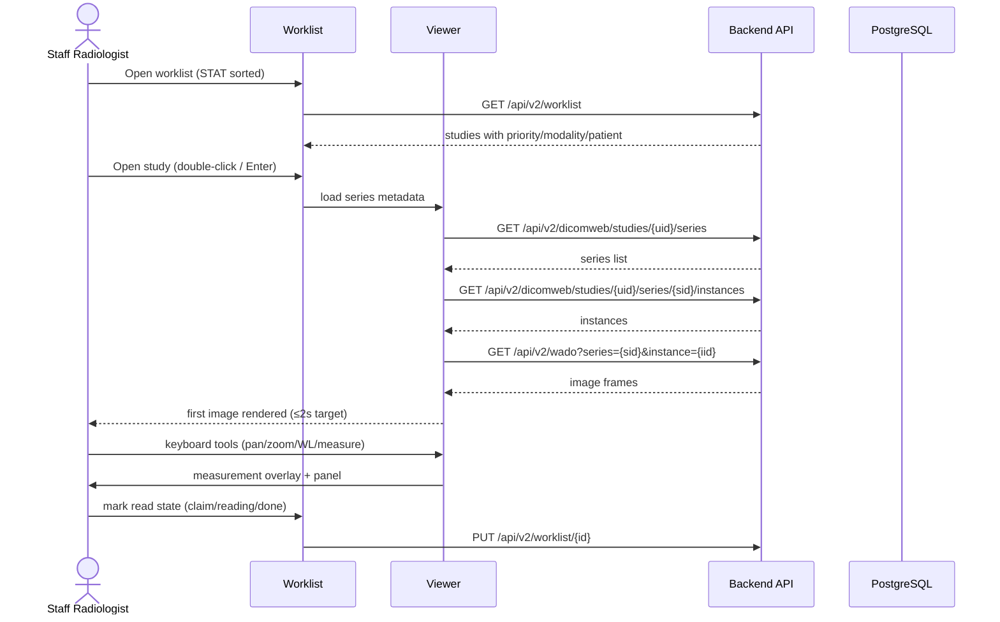
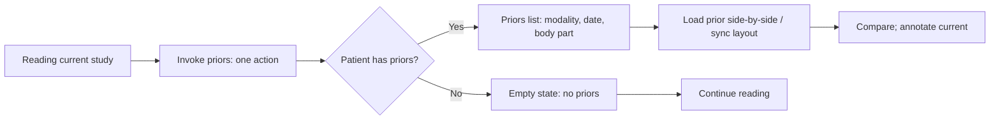
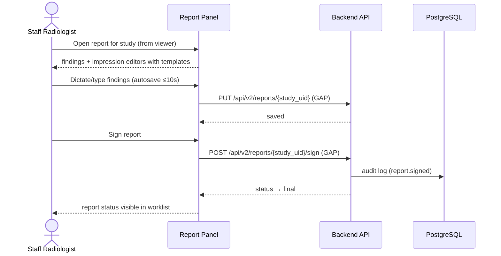
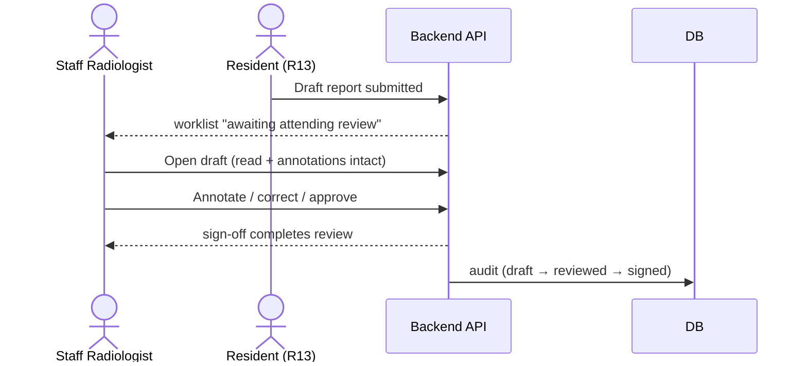
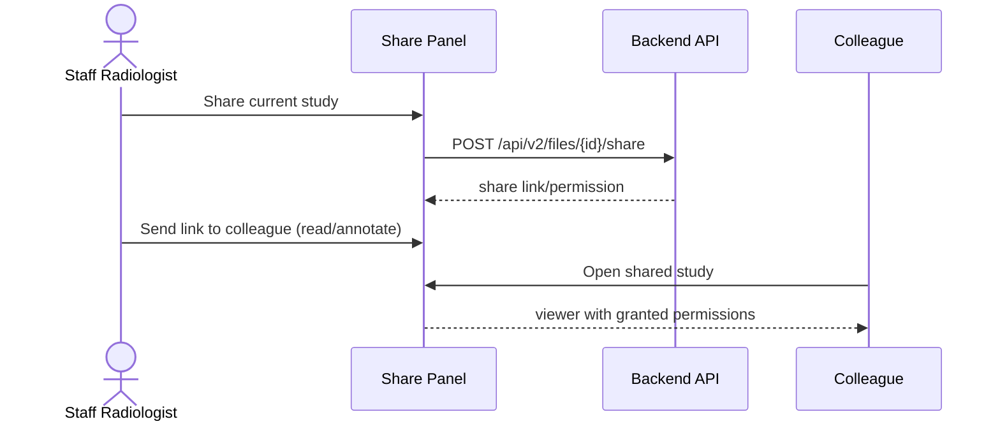
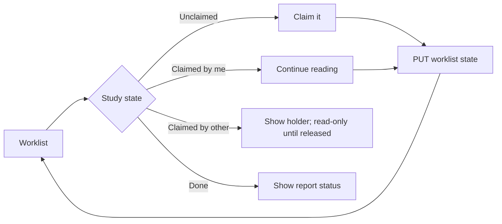
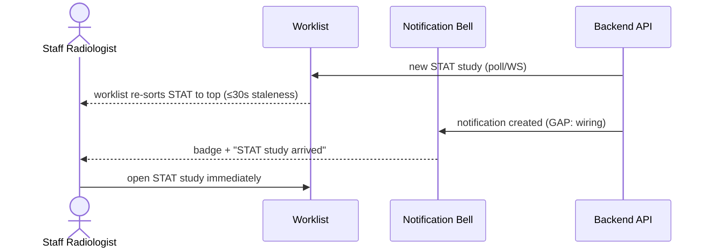

# End-to-End Workflow Maps — Staff Radiologist (R12)

Start from the radiologist's goal: interpret quickly and accurately, minimize
interruptions. Friction points flagged per the ui-ux-designer lens.

---

## Workflow W1: Read a Study from the Worklist (frequency: hourly, criticality: critical)



### Friction & Cognitive Load Points
- **Cold-start cost**: first image latency dominates; require progressive loading —
  render first instance before full series (existing `ProgressiveLoading` pattern).
- Worklist must show priors indicator (whether patient has prior studies) at a glance.
- Keyboard-first: no mouse-dependent step between study selection and viewing.

### Error & Exception Paths
- Study open timeout → partial-load retry with clear error; never blank viewer.
- Instance fetch failure → skip-and-continue with visible "failed instance" badge.
- ES down → worklist unaffected; search-only views degrade.

---

## Workflow W2: Compare with Priors (frequency: daily, criticality: high)



### Friction & Cognitive Load Points
- Priors must be one action from the viewer, not a search detour.
- Side-by-side sync: window/level and pan sync across compared studies.

### Error & Exception Paths
- Priors list timeout → inline retry; reading unaffected.

---

## Workflow W3: Structured Reporting (frequency: hourly, criticality: critical — GATED)



### Friction & Cognitive Load Points
- Templates reduce keystrokes: impression templates per modality.
- Autosave must be invisible (no save button anxiety); conflict on concurrent edit
  handled with clear merge/overwrite choice.

### Error & Exception Paths
- Connection drop mid-report → local draft preserved, sync on reconnect.
- **GAP**: no reporting API — entire workflow blocked pending backend.

---

## Workflow W4: Flag Critical Findings (frequency: weekly, criticality: critical — GATED)

```mermaid
flowchart LR
    A[Find critical finding during read] --> B[Press escalate action]
    B --> C[Confirm: severity + referring clinician]
    C --> D[Notification created (GAP: backend event)]
    D --> E[Referring clinician notified via portal/EMR]
    E --> F[Status tracked until acknowledged]
```

### Friction & Cognitive Load Points
- Escalation must be 2 keystrokes max; no form-filling during an emergency read.
- Acknowledgment tracking needed (R14).

### Error & Exception Paths
- Escalation failure → explicit error + manual fallback (phone note), never silent.

---

## Workflow W5: Resident Attending Review (frequency: daily, criticality: high — GATED)



### Friction & Cognitive Load Points
- Draft/attending state must be explicit in worklist; reviewing must not disturb
  resident's annotations.

### Error & Exception Paths
- GAP: reporting API.

---

## Workflow W6: Consult via Sharing (frequency: weekly, criticality: medium)



### Friction & Cognitive Load Points
- Share permission levels must be explicit (read-only vs annotation).
- Shared annotations feedback (if allowed) must merge cleanly.

### Error & Exception Paths
- Share expiry/permission revoked → clear access-denied state.

---

## Workflow W7: Manage Read States in Worklist (frequency: hourly, criticality: high)



### Friction & Cognitive Load Points
- Read states prevent double-reading; holder info must be visible without hover.
- State transitions must be keyboard-reachable.

### Error & Exception Paths
- State update conflict (two radiologists) → prompt + reload state.

---

## Workflow W8: Respond to STAT Arrival (frequency: daily, criticality: critical)



### Friction & Cognitive Load Points
- STAT re-sort must be non-disruptive (no lost scroll position if mid-read elsewhere).

### Error & Exception Paths
- Notification missed → worklist sort still guarantees visibility.

---

## Cross-Workflow Exception Summary

| Exception | Behavior |
|-----------|----------|
| Instance fetch failure | Skip-and-continue with badge; no viewer crash |
| ES down | Worklist/reading unaffected; search degrades |
| Network drop mid-report | Local draft autosave; sync on reconnect |
| Report edit conflict | Clear overwrite/merge prompt |
| Sharing revoked | Access-denied state on open |
