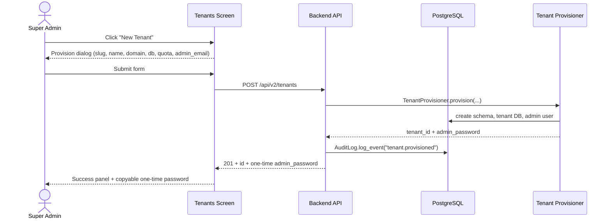
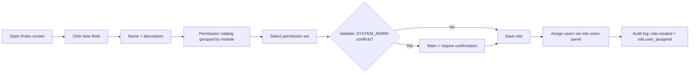
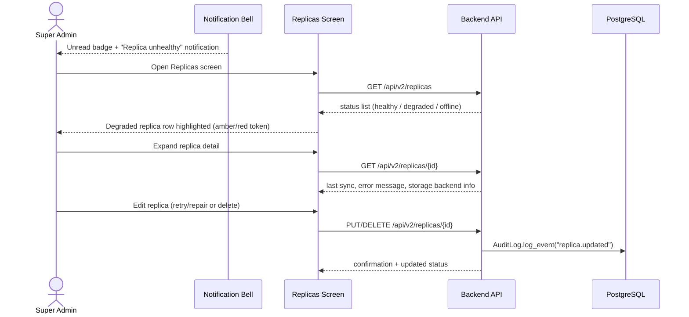
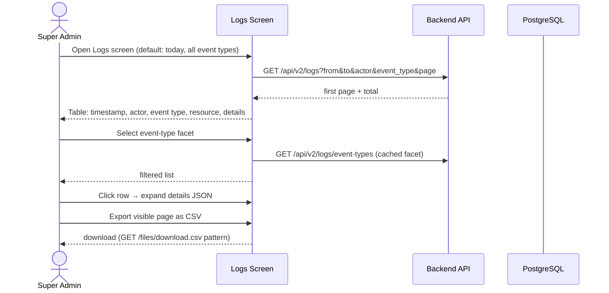
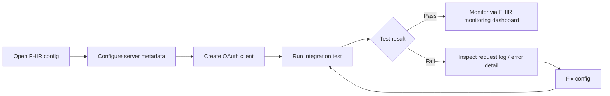
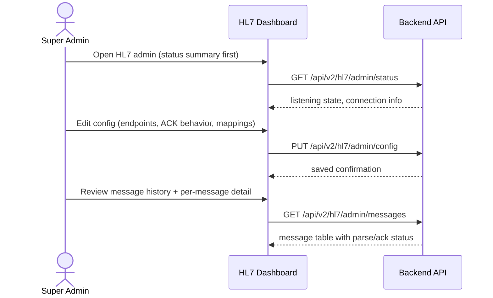
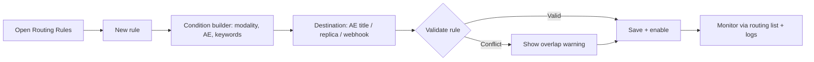
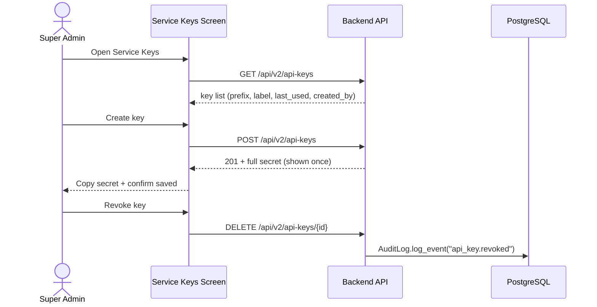
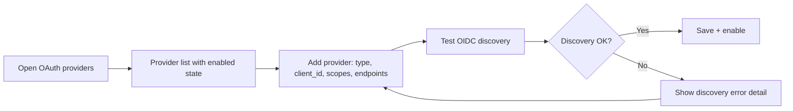

# End-to-End Workflow Maps — Super Admin (R01)

Workflow maps are grounded in user intent, following the ui-ux-designer lens: each
starts from the admin's goal, traces the journey end-to-end, and flags friction points.

---

## Workflow W1: Provision a New Tenant (frequency: weekly, criticality: high)



### Friction & Cognitive Load Points
- One-time admin password must be copied at creation — friction if dismissed; require
  explicit confirmation "I saved the password" before dialog closes.
- DB credentials form fields (host/port/user/password) are ops-heavy; prefill from
  instance defaults to reduce error rate.
- No live validation of slug uniqueness until server round-trip — validate on blur via `GET /tenants` when feasible.

### Error & Exception Paths
- Slug conflict → 409 `CONFLICT` inline field error, form preserved.
- DB provision failure → explicit failure banner with step-level error detail; no
  half-provisioned tenant visible in the list.
- Timeout (> 30s provisioning) → keep dialog open with progress indicator; do not close.

---

## Workflow W2: Create Role with Fine-Grained Permissions (frequency: monthly, criticality: high)



### Friction & Cognitive Load Points
- Permission catalog is large (25+ permissions); group by module (Users, Roles,
  Routing, Integrations, Storage, Logs) with select-all-per-module.
- Role deletion must show dependent users and require explicit confirmation.
- `SYSTEM_ADMIN` grants must trigger a visible warning (privilege escalation).

### Error & Exception Paths
- Role name conflict → inline error.
- Deleting a role still assigned to users → block with list of users, offer reassignment.
- Role edit concurrent with user assignment → 409 with reload prompt.

---

## Workflow W3: Respond to Storage Replica Failure (frequency: on incident, criticality: critical)



### Friction & Cognitive Load Points
- Replica status must be visible without navigating to a detail page — surface status
  column + row-level color coding on the list itself.
- Failure detail (last sync error) must be one click away, not hidden in logs.

### Error & Exception Paths
- Replica offline (storage backend down) → status "offline" with retry action, not silent.
- Delete replica that holds data → confirmation listing pending sync count.

---

## Workflow W4: Audit Log Investigation (frequency: daily, criticality: high)



### Friction & Cognitive Load Points
- Large detail JSON must be readable (pretty-printed, copyable), not raw blob.
- Date-range defaults (last 24h) reduce initial query weight.
- CSV export of current filter set (not just page) expected.

### Error & Exception Paths
- Query timeout on large range → prompt to narrow date range (no silent spinner forever).
- Empty result → "No audit events match the filters" + clear-filters action.

---

## Workflow W5: Configure FHIR Integration (frequency: quarterly, criticality: medium)



### Friction & Cognitive Load Points
- Test endpoint (`POST /fhir/admin/test`) must return structured result (request/response,
  status, latency), not just pass/fail.
- Recent requests dashboard (`/fhir/admin/requests`) should surface 4xx/5xx rates prominently.

### Error & Exception Paths
- OAuth client secret must be copyable once and never re-displayed (secret handling).
- Integration down → FHIR monitoring dashboard shows degraded state + notification.

---

## Workflow W6: Configure HL7 Interface (frequency: quarterly, criticality: medium)



### Friction & Cognitive Load Points
- Message detail must show raw payload with parse errors highlighted per segment.
- Status should be visible on the dashboard header at all times (no navigation needed).

### Error & Exception Paths
- HL7 listener down → status "not listening" + retry action + notification.
- NACK/parse failures → visible in message history with error column.

---

## Workflow W7: Route Studies via DICOM Routing Rules (frequency: monthly, criticality: high)



### Friction & Cognitive Load Points
- Rule ordering matters — show priority order and allow drag-to-reorder.
- Overlap detection prevents ambiguous routing (two rules matching same study).

### Error & Exception Paths
- Invalid destination AE → validation error at save time, not at routing time.
- Disabled integration target → warning badge on rule row.

---

## Workflow W8: Manage Service API Keys (frequency: quarterly, criticality: high)



### Friction & Cognitive Load Points
- Full secret shown once — require "I saved the secret" confirmation (same pattern as W1).
- Show `last_used` to identify stale keys for rotation.

### Error & Exception Paths
- Revoke must confirm with key label in the confirmation text.
- Creating key without expiry → warning suggesting rotation schedule.

---

## Workflow W9: Manage OAuth/SSO Providers (frequency: quarterly, criticality: high)



### Friction & Cognitive Load Points
- Client secrets stored encrypted, never re-displayed (`backend/api/encryption.py`).
- Provider enable/disable must be visible in the list without opening detail.

### Error & Exception Paths
- Disabled provider with existing users → warn before disabling (login impact).

---

## Workflow W10: System Health & Incident Response (frequency: daily, criticality: critical)

```mermaid
flowchart LR
    A[Dashboard: health summary] --> B{Any degraded area?}
    B -->|No| C[No action]
    B -->|Yes| D[Drill into area dashboard]
    D --> E[Integrations: HL7/FHIR/DICOM metrics]
    D --> F[Storage: replica status]
    D --> G[Logs: correlated audit events]
    E --> H[Remediate (W3/W5/W6 patterns)]
    F --> H
    G --> H
    H --> I[Notify stakeholders via notification bell]
```

### Friction & Cognitive Load Points
- Aggregate health endpoint implemented (`GET /v2/dashboard/health`, METRICS_READ) —
  dashboard composes storage/DICOM/HL7/FHIR/auth status from a single call.
  Drill-down links carry the time scope to area dashboards where supported.
- Correlating an incident across logs, metrics, and replicas requires window-switching;
  requirement: time-scoped links from dashboard to filtered logs.

### Error & Exception Paths
- Metrics endpoint down → dashboard shows "metrics unavailable" rather than erroring the whole page.

---

## Cross-Workflow Exception Summary

| Exception | Behavior |
|-----------|----------|
| ES down | Search degrades gracefully; admin CRUD unaffected |
| Backend down | All screens show error state with retry; no partial data |
| Permission denied | 403 mapped to "Access denied" screen, no data leak |
| Session expired | Re-auth modal preserving intended destination |
