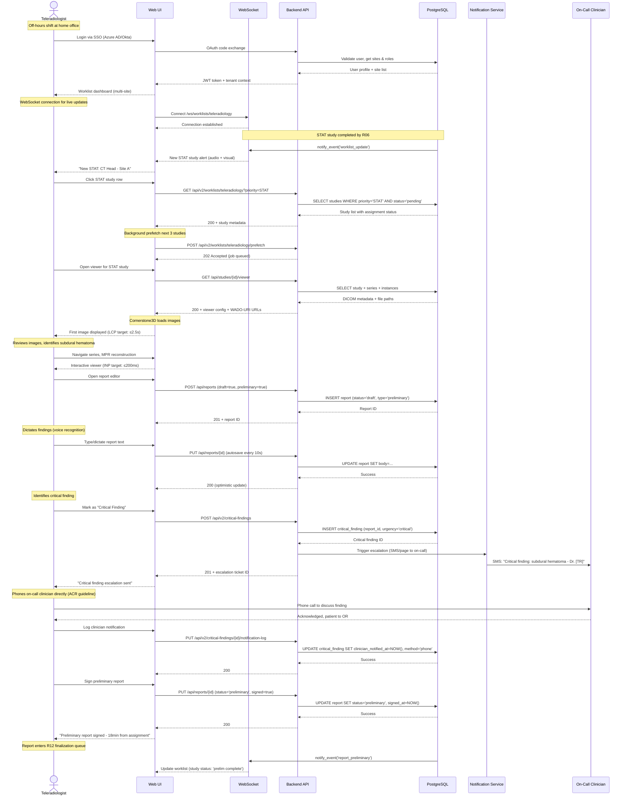
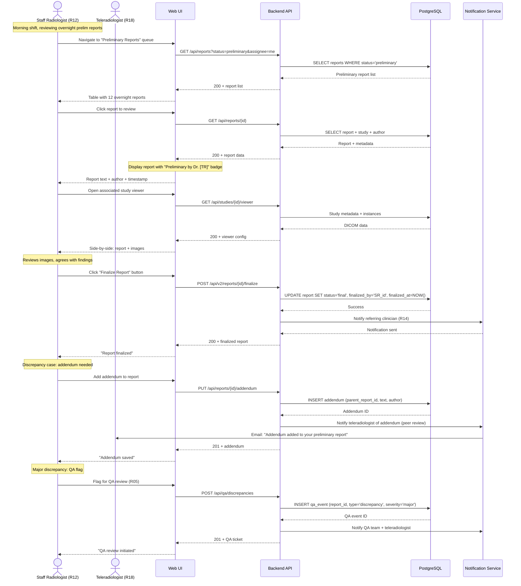
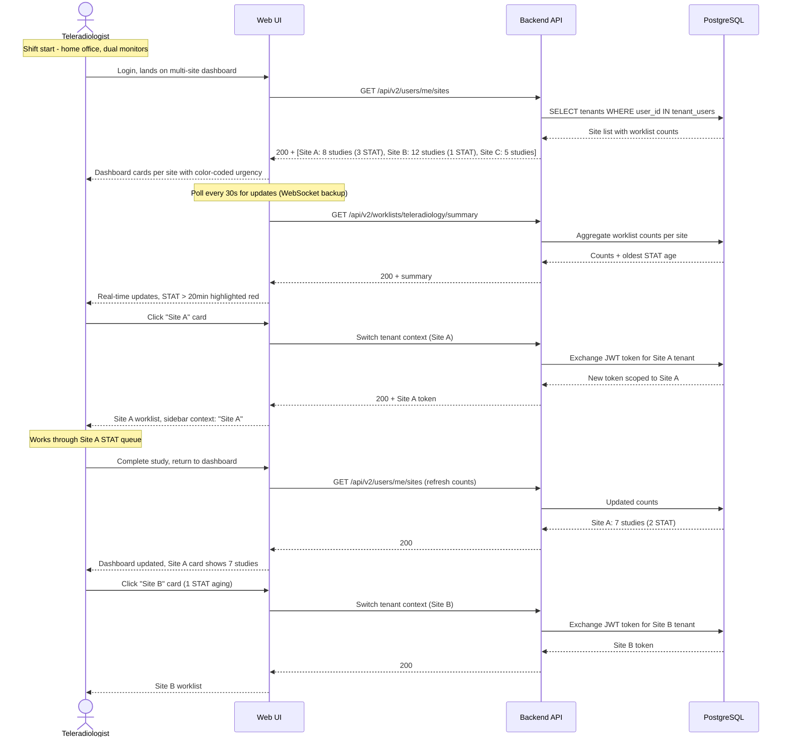
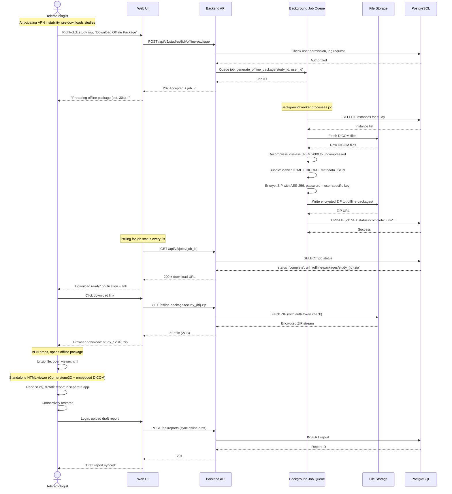
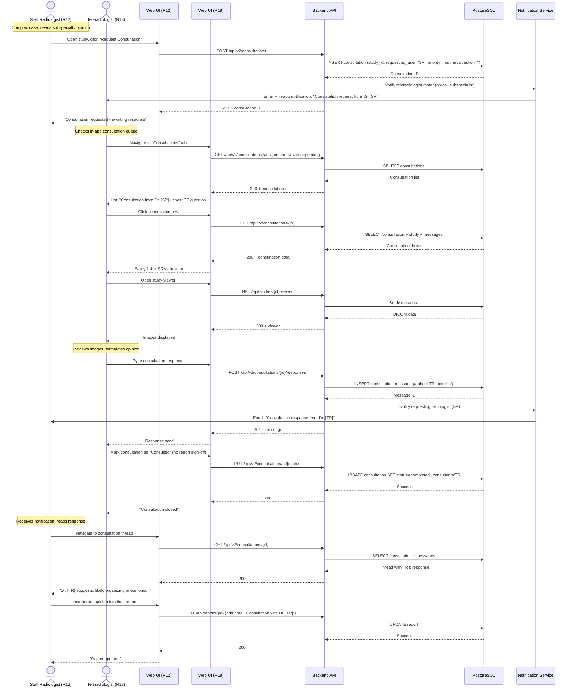

# End-to-End Workflow Maps — Teleradiologist (R18)

**Role ID**: R18  
**Generated**: 2026-08-02  
**Version**: 1.0.0

---

## Workflow W1: Remote STAT Study Reading (frequency: multiple per shift, criticality: critical)

**User Intent**: Rapidly access and interpret urgent imaging for off-hours coverage with critical finding communication.

### Friction & Cognitive Load Points
- **SSO login latency**: OAuth redirect + token exchange can take 5-10s over WAN — user perceives delay before seeing worklist
- **First-image load time**: 2.5s target may feel slow for STAT cases — aggressive prefetch and CDN caching needed
- **Dual workflow (report + phone)**: Teleradiologist must context-switch from UI to phone for critical findings — no automated dialing integration
- **Multi-site monitoring**: Visual scanning across multiple site tabs — lacks unified "all sites STAT" alert board
- **VPN instability**: Home network VPN drops can interrupt workflow mid-study — offline fallback needed

### Error & Exception Paths
1. **SSO authentication failure**: 
   - User sees "Unable to authenticate with [Provider]" 
   - Fallback: retry SSO, contact IT support
   - No password fallback for security
2. **WebSocket connection failure**:
   - UI shows "Live updates disconnected" warning banner
   - Fallback: poll API every 30s for worklist updates
   - Reconnect on network recovery
3. **Image load timeout (>10s)**:
   - UI shows "Image loading slowly - poor connection?" message
   - Offer: download offline package, switch to lower-quality preview
   - Log: network conditions for performance monitoring
4. **Critical finding escalation failure (SMS/page service down)**:
   - UI shows "Automated notification failed - call clinician directly"
   - Log: escalation failure for manual follow-up
   - Alert: PACS admin of notification service outage
5. **Report autosave failure (DB unreachable)**:
   - UI shows "Unsaved changes - connection lost"
   - Fallback: save draft to IndexedDB, sync when connection restored
   - Warning: do not close browser tab

---

## Workflow W2: Preliminary Report Review & Finalization (frequency: daily, criticality: high)

**User Intent**: On-site radiologist (R12) reviews teleradiologist preliminary reports and upgrades to final status.

### Friction & Cognitive Load Points
- **Report-to-image switching**: R12 must toggle between report view and viewer — lacks integrated side-by-side layout
- **Discrepancy documentation**: No structured discrepancy classification (false positive, false negative, missed finding) — free-text addendum only
- **Peer feedback loop**: Teleradiologist (R18) receives email notification but has no in-app feedback dashboard

### Error & Exception Paths
1. **Finalization conflict (report modified by R18)**:
   - UI shows "Report updated by [TR] 2min ago - reload before finalizing"
   - Fallback: reload report, re-review, finalize
2. **Addendum save failure**:
   - UI shows "Unable to save addendum - try again"
   - Fallback: copy text to clipboard, retry
3. **QA notification failure**:
   - UI shows "QA team notified (email pending)"
   - Fallback: manual email to QA coordinator

---

## Workflow W3: Multi-Site Coverage Dashboard (frequency: continuous during shift, criticality: medium)

**User Intent**: Monitor worklists across multiple hospital sites, prioritize by urgency and turnaround time.

### Friction & Cognitive Load Points
- **Context switching overhead**: JWT token exchange for each site switch takes 1-2s — feels sluggish
- **Lack of unified STAT queue**: Must manually monitor multiple site cards — no "all sites STAT" view
- **Visual priority cues**: Color coding helps but lacks audio alert for new STAT arrivals across sites
- **No predictive workload**: Dashboard shows current counts but not projected inbound studies (HL7 scheduled exams)

### Error & Exception Paths
1. **Site unreachable (DB down for one tenant)**:
   - UI shows "Site C unavailable - contact Site C IT"
   - Fallback: continue working other sites, alert PACS admin
2. **Token exchange failure**:
   - UI shows "Unable to switch to Site B - session expired?"
   - Fallback: re-authenticate via SSO
3. **Stale worklist counts (WebSocket + polling both fail)**:
   - UI shows "Last updated: 5min ago" warning
   - Fallback: manual refresh button, alert user of connectivity issue

---

## Workflow W4: Offline Study Access (frequency: as-needed, criticality: medium)

**User Intent**: Download study for offline reading during connectivity outages or travel.

### Friction & Cognitive Load Points
- **Download time**: 30s for 500-instance study (2GB) — requires proactive planning before VPN issues
- **Password management**: User must securely store decryption password — potential friction
- **Offline report drafting**: Separate app (Word, Notes) — no integrated offline editor, must manually sync on reconnect
- **Storage cleanup**: User must manually delete downloaded ZIP files — no auto-expiry warning

### Error & Exception Paths
1. **Background job failure (disk full, DB timeout)**:
   - UI shows "Offline package generation failed - contact support"
   - Fallback: retry job, manual DICOM export via PACS admin
2. **Download interrupted (network drop mid-transfer)**:
   - Browser shows "Download failed"
   - Fallback: resume download (if server supports Range requests), or regenerate package
3. **Decryption failure (wrong password, corrupted ZIP)**:
   - Offline viewer shows "Unable to decrypt package"
   - Fallback: re-download package, verify file integrity
4. **Offline report sync conflict (study already finalized by R12)**:
   - UI shows "Study finalized while offline - save as addendum?"
   - Fallback: attach offline draft as addendum, notify R12

---

## Workflow W5: Second Opinion Consultation (frequency: daily, criticality: medium)

**User Intent**: Provide consultative second opinion to on-site radiologist without taking over primary read responsibility.

### Friction & Cognitive Load Points
- **Asynchronous communication**: Email + in-app notifications — lacks real-time chat or video for urgent consults
- **Context loss**: Teleradiologist must reconstruct clinical question from text — no voice/video context
- **Report integration**: On-site radiologist must manually copy consultation text into report — no auto-append

### Error & Exception Paths
1. **No consultant available (all teleradiologists offline)**:
   - UI shows "No consultants available - try later or escalate to attending"
   - Fallback: email to department head, manual phone call
2. **Consultation response timeout (>24h no response)**:
   - UI shows "Consultation pending >24h" warning to requesting radiologist
   - Escalation: auto-notify department coordinator
3. **Consultation assignment conflict (multiple TR respond)**:
   - First responder assigned, others notified "Already answered by Dr. [TR]"

---

## Integration Touchpoints Summary

| Workflow | External System | Integration Type | Data Flow |
|----------|-----------------|------------------|-----------|
| W1 (STAT Reading) | Hospital On-Call System | SMS/Page API (Twilio, PagerDuty) | Critical findings → clinician notification |
| W1 (STAT Reading) | Voice Dictation (Dragon Medical) | Plugin/API | Audio → report text |
| W2 (Finalization) | Referring Clinician Portal | Notification Service | Final report → R14 notification |
| W3 (Multi-Site) | Azure AD / Okta | OAuth/OIDC | SSO authentication + site access |
| W4 (Offline) | None | Standalone HTML viewer | Self-contained DICOM viewer bundle |
| W5 (Consultation) | Email Service | SMTP | Consultation notifications |

## Performance Targets by Workflow

| Workflow | Critical Metric | Target | Rationale |
|----------|-----------------|--------|-----------|
| W1 | First-image load (WAN) | ≤ 2.5s p95 | ACR teleradiology diagnostic threshold |
| W1 | STAT turnaround (assignment → prelim report) | ≤ 30min | ACR guideline + hospital SLA |
| W1 | Critical finding notification latency | ≤ 15min | ACR guideline |
| W2 | Preliminary report review queue load | ≤ 2s LCP | R12 morning workflow efficiency |
| W3 | Site-switching token exchange | ≤ 2s | Minimize context-switch overhead |
| W3 | Worklist update staleness | ≤ 5s | Real-time confidence for remote monitoring |
| W4 | Offline package generation | ≤ 30s for 500-inst study | Proactive download window |
| W5 | Consultation response time | ≤ 4h (routine), ≤ 1h (urgent) | Peer review timeliness |
