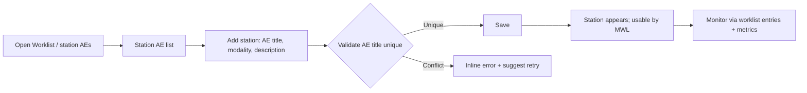
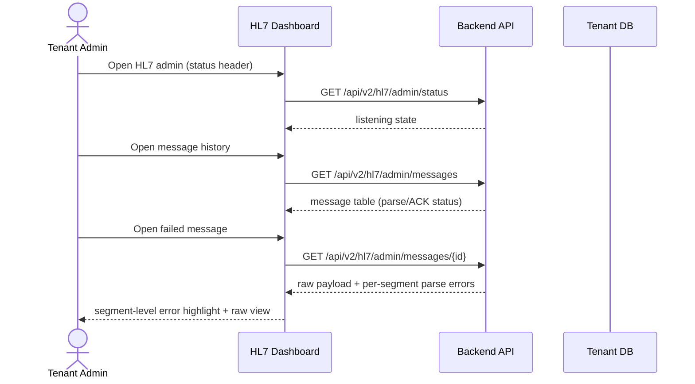
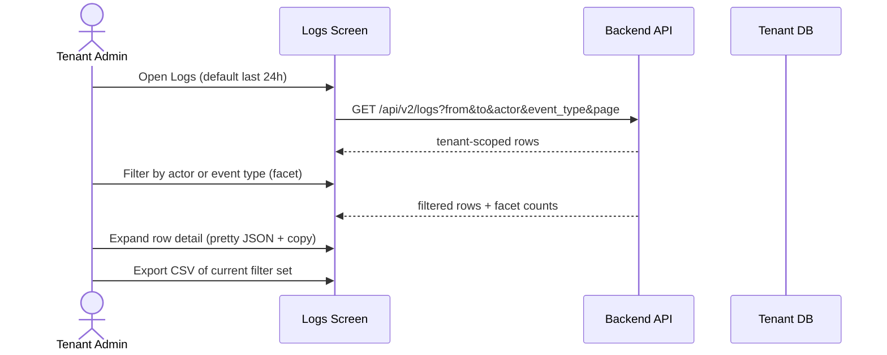
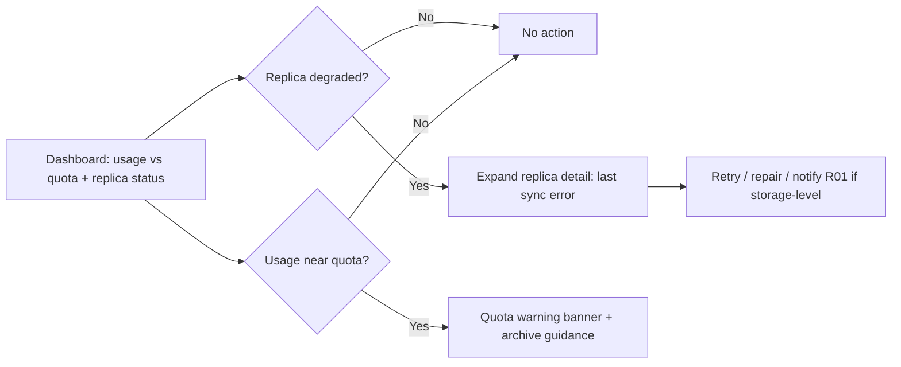
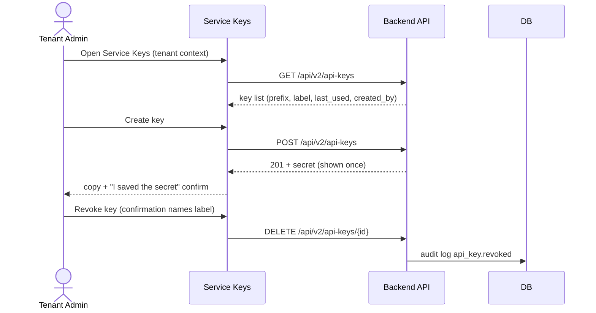
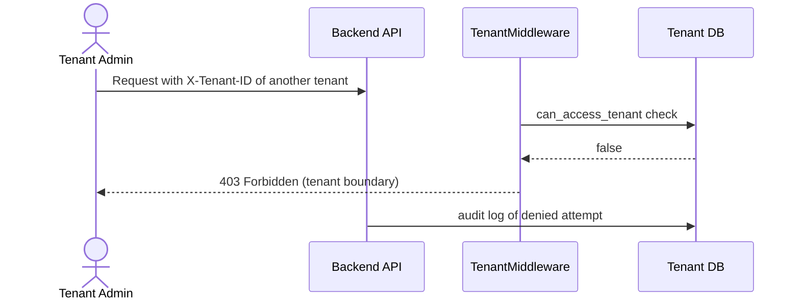

# End-to-End Workflow Maps — Hospital IT / Tenant Admin (R02)

All workflows are tenant-scoped by the middleware (`X-Tenant-ID`); cross-tenant
attempts are 403. Start from the admin's goal, per the ui-ux-designer lens.

---

## Workflow W1: Onboard a New Tenant User (frequency: weekly, criticality: high)

```mermaid
sequenceDiagram
    actor Admin as Tenant Admin
    participant UI as Users Screen
    participant API as Backend API
    participant DB as Tenant DB
    Admin->>UI: Open Users (tenant context)
    UI->>API: GET /api/v2/users (X-Tenant-ID)
    API-->>UI: tenant user list
    Admin->>UI: Add user (username, name, email, role, temp password)
    UI->>API: POST /api/v2/users
    API->>DB: create user + audit log (actor, tenant)
    API-->>UI: 201 + user row
    Admin->>UI: Assign role
    UI->>API: POST /api/v2/users/role
    API-->>UI: role updated
    UI-->>Admin: success toast; row shows role
```

### Friction & Cognitive Load Points
- Role picker should be limited to tenant-visible roles (no super-admin role offered).
- Temp password policy must be surfaced in the create form, not after submit.

### Error & Exception Paths
- Duplicate username → inline error, form preserved.
- 403 (role outside tenant) → inline error with explanation; never generic failure.

---

## Workflow W2: Configure Modality Worklist Station (frequency: monthly, criticality: high)



### Friction & Cognitive Load Points
- AE title uniqueness must be checked against tenant scope (two tenants may reuse titles).
- Modality list should come from a controlled vocabulary (DR, CR, CT, MR, PET, US, MG, RF, DX, etc.) — free text creates garbage.

### Error & Exception Paths
- Station referenced by active routing rules → warn before deletion, list referencing rules.

---

## Workflow W3: Configure DICOM Routing Rule (frequency: monthly, criticality: high)

```mermaid
sequenceDiagram
    actor Admin as Tenant Admin
    participant UI as Routing Screen
    participant API as Backend API
    Admin->>UI: New rule
    UI->>UI: Condition builder (modality, AE, keywords; AND/OR)
    Admin->>UI: Set destination (AE / replica / webhook)
    UI->>API: POST /api/v2/routing
    API-->>UI: created
    UI-->>Admin: Rule listed with priority; overlap warning if conflicting
```

### Friction & Cognitive Load Points
- Destination picker must only list tenant-scoped destinations.
- Rule order is meaningful — drag-to-reorder with persisted priority.

### Error & Exception Paths
- Overlapping rule → confirmation listing existing rule.
- Destination disabled → warning badge on the rule row.

---

## Workflow W4: Diagnose HL7 Message Failure (frequency: weekly, criticality: high)



### Friction & Cognitive Load Points
- Errors must be highlighted per HL7 segment with a plain-language hint, not only raw text.
- Status must be visible in the dashboard header without navigation.

### Error & Exception Paths
- Listener down → "not listening" + retry + notification (same as R01 W6).

---

## Workflow W5: Configure FHIR Integration (frequency: quarterly, criticality: medium)

```mermaid
flowchart LR
    A[FHIR config] --> B[Server config]
    B --> C[OAuth client (secret shown once)]
    C --> D[Run test: POST /fhir/admin/test]
    D --> E{Structured result}
    E -->|Pass| F[Monitor /fhir/admin/requests]
    E -->|Fail| G[Inspect error detail → fix config]
    G --> D
```

### Friction & Cognitive Load Points
- Client secrets follow the show-once + confirm pattern (same as R01 US-R01-08).
- Request dashboard must surface 4xx/5xx rates.

### Error & Exception Paths
- Integration down → degraded state on monitoring + notification.

---

## Workflow W6: Review Tenant Audit Trail (frequency: daily, criticality: high)



### Friction & Cognitive Load Points
- Tenant admin only sees own tenant events — filters must never offer other tenants' actors.
- Timeout on broad range → prompt to narrow, never endless spinner.

### Error & Exception Paths
- Empty result → "No audit events match" + clear filters.

---

## Workflow W7: Monitor Tenant Storage & Replicas (frequency: daily, criticality: high)



### Friction & Cognitive Load Points
- GAP: no tenant usage-vs-quota endpoint — dashboard must compose from replicas +
  files metrics; flagged for backend.
- Storage-level failures may need R01 escalation — surface "notify PACS admin" action.

### Error & Exception Paths
- Replica offline → status "offline" + retry + notification.

---

## Workflow W8: Manage Service API Keys for Tenant Integrations (frequency: quarterly, criticality: high)



### Friction & Cognitive Load Points
- `last_used` surfaced to identify stale keys.
- Rotation warning when key has no expiry.

### Error & Exception Paths
- Revoke confirmation must include key label.

---

## Workflow W9: Respond to Cross-Tenant Boundary Attempt (frequency: rare, criticality: critical)



### Friction & Cognitive Load Points
- UI must prevent the attempt: tenant switcher only lists accessible tenants; no manual
  tenant input fields in R02 screens.
- Denied attempts are logged for security review (R05).

### Error & Exception Paths
- n/a — 403 is the designed outcome; UI shows access-denied state.

---

## Cross-Workflow Exception Summary

| Exception | Behavior |
|-----------|----------|
| Cross-tenant access | 403 + audit log; UI never exposes other tenants |
| ES down | Search degrades gracefully; CRUD unaffected |
| Backend down | Error state + retry on all screens |
| Session expired | Re-auth modal preserving destination |
| Quota exceeded | Warning banner; uploads blocked with clear message |
